# JaviviMonitor — Modelo E-R propuesto

> **Documento 2 de la reestructuración.** El documento 1 (`JaviviMonitor-documentacion-actual.md`) describe el estado actual.
> **Motor asumido:** PostgreSQL 16+ (con `pgcrypto` para UUID y, opcionalmente, TimescaleDB para las series).
> **Alcance:** información y funciones. El modelo de identidad (usuarios, sesiones, credenciales) se asume resuelto por el proveedor de auth y aquí se referencia únicamente como `app_user(id)`.

---

## 0. La idea central

El pedido es: *"por módulo exista su tabla de lo que se muestra, y poder asignarle esa información a mi usuario objetivo"*.

Eso se resuelve separando tres cosas que hoy están mezcladas en el código:

```
   QUÉ EXISTE              →  CÓMO SE MUESTRA        →  QUIÉN LO VE
   (datos del dominio)        (catálogo de bloques)     (entitlements)

   protocol_tvl_snapshot      block "Top protocolos"    grant(role=cliente_pro,
   yield_pool_snapshot        block "Explorador de       block=top_protocolos,
   bbi_score                        yields"              action=view)
   ...                        ...                       ...
```

La pieza que falta hoy y que vertebra todo el modelo es el **catálogo de presentación**: una tabla de `module` → `view` → `block` → `dataset`. Un bloque es la unidad más chica que tiene sentido conceder o negar (una card, una tabla, un gráfico). Los permisos **no** se cuelgan de las tablas de datos, se cuelgan del catálogo. Así podés vender "Tokenization Hub sin Bolivia Opportunities" o "todo menos el BBI" sin tocar una sola query de negocio.

**Regla de oro:** ninguna tabla de datos conoce al usuario. Ninguna tabla de permisos conoce el dominio. El catálogo es el único puente.

---

## 1. Principios de diseño

1. **Dimensión vs. hecho.** Todo lo que tiene identidad estable (una red, un protocolo, un pool, un activo) es una dimensión. Todo lo que tiene fecha es un hecho en tabla de series.
2. **`NULL` ≠ `0`.** Se conserva la regla del código actual: un dato que la fuente no publica es `NULL` y lleva su motivo en una columna `unavailable`.
3. **Trazabilidad obligatoria.** Cada hecho apunta a `source_fetch_id`. Cada dato curado lleva `source_name` + `source_url` + `verified_on`.
4. **Alias en tabla aparte.** Cada fuente nombra las cosas distinto (`llamaName`, `growthepie key`, `l2beat id`, `geckoId`). Eso va en `*_alias`, nunca como columnas en la dimensión.
5. **Curado versionado.** Los datos editoriales (scores BBI, perfiles de riesgo, oportunidades) llevan versión y vigencia: `valid_from` / `valid_to`. Cambiar un score no pisa el anterior.
6. **Derivados materializados.** El BBI, los índices y los scorings se **calculan y se guardan** por corte, con la versión de metodología usada. Hoy se recalculan en cada request y no se pueden auditar.
7. **Referencia polimórfica controlada.** El histórico universal (hoy `HistoryTarget`) se modela con `entity_kind` + `entity_ref` contra una tabla `entity` única, no con 10 FKs opcionales.
8. **Soft delete y auditoría** en todo lo curado y en todo lo de usuario.
9. **RLS (Row Level Security)** como red de seguridad: aunque la app filtre, la base también filtra.
10. **Snake_case, singular, `id uuid` o `id text` cuando el id natural es estable** (slug de DeFiLlama, id de CoinGecko).

---

## 2. Arquitectura del esquema (7 esquemas Postgres)

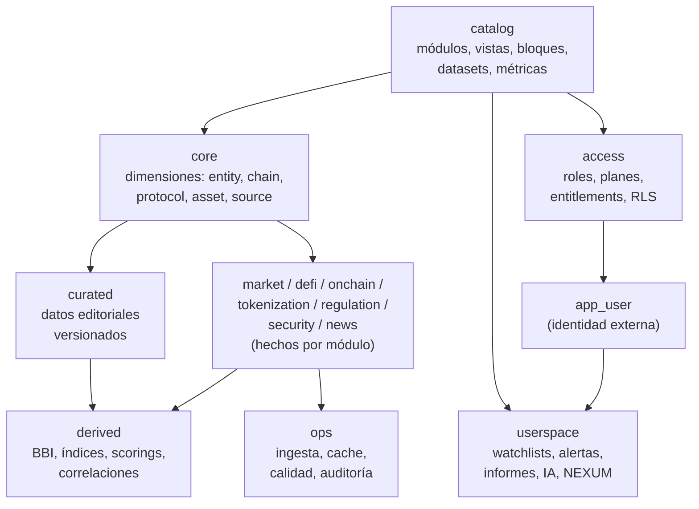

| Esquema | Contiene | Escritura |
| --- | --- | --- |
| `catalog` | Qué existe como producto: módulos, vistas, bloques, datasets, métricas, glosario | Equipo / migraciones |
| `access` | Roles, planes, entitlements, políticas | Admin |
| `core` | Dimensiones compartidas: `entity`, `chain`, `protocol`, `asset`, `issuer`, `source` | Ingesta + admin |
| `market`, `defi`, `onchain`, `tokenization`, `regulation`, `security`, `news`, `build` | Hechos por módulo | Ingesta |
| `curated` | Datos editoriales versionados (lo que hoy vive en `/data/*.json`) | Editor vía panel |
| `derived` | BBI, índices, scorings, momentum, correlaciones | Jobs de cálculo |
| `userspace` | Artefactos del usuario | Usuario |
| `ops` | Jobs, corridas, cache, banderas de calidad, auditoría | Sistema |

---

## 3. `catalog` — el catálogo de presentación

Esta es la capa nueva y la que responde directamente al pedido.

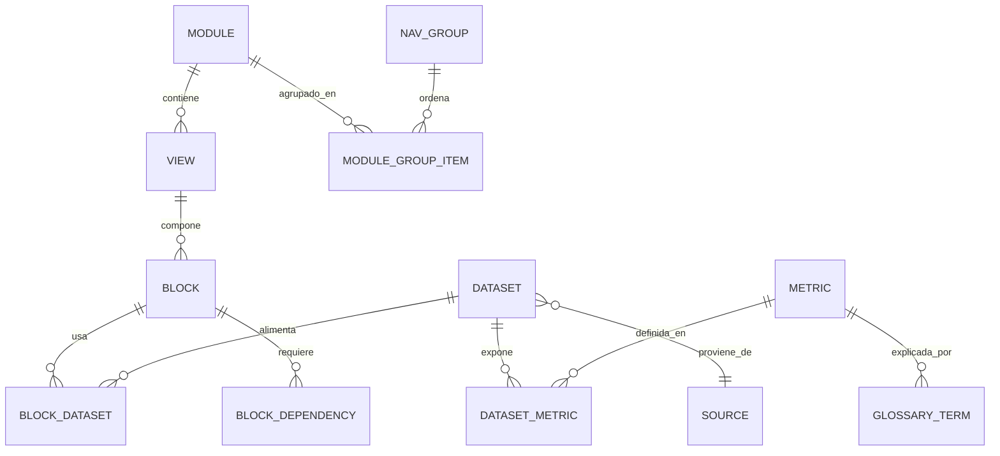

### `catalog.nav_group`
Los 8 verticales del sidebar actual.

| Columna | Tipo | Notas |
| --- | --- | --- |
| `id` | `text` PK | `executive_brief`, `institutional`, `indices`, `blockchain`, `bolivia`, `market`, `research_lab`, `nexum` |
| `title` | `text` | "Executive Brief" |
| `sort_order` | `int` | |
| `icon` | `text` | |

### `catalog.module`
Un módulo de negocio. Es la unidad gruesa de venta y de permiso.

| Columna | Tipo | Notas |
| --- | --- | --- |
| `id` | `text` PK | `defi_protocols`, `defi_yields`, `stablecoins`, `tokenization`, `bbi`, `build_cost`, `market`, `onchain`, `security`, `cbdc`, `bolivia`, `capital_markets`, `news`, `fan_tokens`, `partnerships`, `indices`, `correlations`, `ai_workspace`, `report`, `nexum` |
| `nav_group_id` | `text` FK | |
| `name` | `text` | "Protocol Analytics" |
| `code` | `char(3)` | "DFI" — el código del sidebar contraído |
| `description` | `text` | |
| `sort_order` | `int` | |
| `is_active` | `bool` | |

### `catalog.view`
Una página. Mapea 1:1 con las 27 rutas actuales.

| Columna | Tipo | Notas |
| --- | --- | --- |
| `id` | `text` PK | `defi_overview`, `yields_explorer`, … |
| `module_id` | `text` FK | |
| `route` | `text` UNIQUE | `/defi`, `/defi/yields` |
| `title` | `text` | |
| `subtitle` | `text` | |
| `is_dynamic` | `bool` | `true` para `/tokenizacion/clases/[slug]` |
| `sort_order` | `int` | |

### `catalog.block` ★
**La unidad de permiso.** Cada card, tabla o gráfico de una vista.

| Columna | Tipo | Notas |
| --- | --- | --- |
| `id` | `text` PK | `defi.top_protocols`, `defi.revenue`, `yields.pool_table` |
| `view_id` | `text` FK | |
| `kind` | `enum` | `table`, `chart`, `kpi_strip`, `map`, `treemap`, `list`, `text`, `form`, `export` |
| `title` | `text` | |
| `lead` | `text` | el copy explicativo que hoy vive en el componente |
| `component` | `text` | nombre del componente React, para el render |
| `layout` | `jsonb` | `{col, row, span}` |
| `sort_order` | `int` | |
| `is_premium` | `bool` | atajo: fuera del plan base por defecto |
| `min_freshness` | `enum` | `LIVE` \| `HOURLY` \| `DAILY` \| `MONTHLY` \| `STATIC` |

### `catalog.dataset` ★
La consulta o tabla que alimenta a un bloque. Es el nexo entre presentación y datos.

| Columna | Tipo | Notas |
| --- | --- | --- |
| `id` | `text` PK | `defi.protocol_tvl_top`, `yields.pool_universe` |
| `module_id` | `text` FK | |
| `physical_table` | `text` | `defi.protocol_tvl_snapshot` |
| `access_fn` | `text` | función SQL que lo sirve, p. ej. `defi.fn_top_protocols(limit)` |
| `source_id` | `text` FK → `core.source` | fuente primaria |
| `cadence` | `enum` | igual que `min_freshness` |
| `retention_days` | `int` | |
| `is_proprietary` | `bool` | `true` para BBI, índices y scorings — el activo que se vende |
| `row_scope` | `enum` | `global` \| `per_entity` \| `per_user` |

### `catalog.block_dataset`
Un bloque puede leer varios datasets (la portada cruza 4 fuentes).

| `block_id` FK | `dataset_id` FK | `role` (`primary` \| `secondary` \| `annotation`) | PK compuesta |

### `catalog.metric` ★
El diccionario de métricas. Hoy está disperso en labels de componentes.

| Columna | Tipo | Notas |
| --- | --- | --- |
| `id` | `text` PK | `tvl_usd`, `apy_total`, `bbi_score`, `active_addresses_24h` |
| `label` | `text` | "TVL" |
| `unit` | `enum` | `usd`, `price`, `pct`, `pp`, `score`, `count`, `ratio`, `bob` |
| `higher_is_better` | `bool` \| `null` | `null` = neutral |
| `definition` | `text` | la definición que hoy está en el tooltip |
| `formula` | `text` | si es derivada |
| `precision` | `int` | |
| `compact_format` | `bool` | notación compacta (1,2 B) |

### `catalog.dataset_metric`
| `dataset_id` | `metric_id` | `column_name` | `is_default_sort` |

### `catalog.glossary_term`
| `id` | `term` | `definition` | `module_id` | `metric_id` (nullable) |

### `catalog.block_dependency`
Un bloque puede depender de otro (el drill-down del histórico depende de la fila que lo abrió).

| `block_id` | `depends_on_block_id` | `kind` (`drilldown` \| `filter` \| `context`) |

---

## 4. `access` — asignar información a un usuario

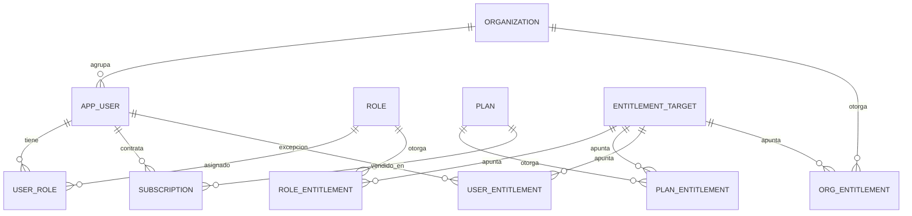

### El grant polimórfico

Un permiso es siempre **sujeto × objeto × acción × efecto**:

```sql
CREATE TYPE access.subject_kind AS ENUM ('user','role','plan','organization');
CREATE TYPE access.object_kind  AS ENUM ('module','view','block','dataset','metric','entity','export_format');
CREATE TYPE access.action_kind  AS ENUM ('view','drill','export','api','share','edit');
CREATE TYPE access.effect       AS ENUM ('allow','deny');
```

### `access.entitlement` ★

| Columna | Tipo | Notas |
| --- | --- | --- |
| `id` | `uuid` PK | |
| `subject_kind` | `subject_kind` | |
| `subject_id` | `text` | id de user/role/plan/org |
| `object_kind` | `object_kind` | |
| `object_id` | `text` | `defi.top_protocols`, `bbi`, `tvl_usd`… |
| `action` | `action_kind` | |
| `effect` | `effect` | `deny` gana siempre |
| `constraint_json` | `jsonb` | límites finos: `{"max_rows":25,"history_days":90,"chains":["Ethereum","Tron"],"delay_minutes":1440}` |
| `valid_from` / `valid_to` | `timestamptz` | vigencia |
| `granted_by` | `uuid` FK | |
| `note` | `text` | |

> **Un solo lugar para todos los permisos.** Roles, planes, organizaciones y excepciones por usuario escriben en la misma tabla, cambiando `subject_kind`. Evita cuatro tablas gemelas.

### `constraint_json` — el detalle que hace vendible el producto

| Clave | Efecto |
| --- | --- |
| `max_rows` | el cliente básico ve top 10, el pro ve los 200 |
| `history_days` | 90 días vs. serie completa |
| `delay_minutes` | datos con retardo para el tier gratuito |
| `chains` / `sectors` / `assets` | recorte por entidad (un cliente ve solo su red) |
| `export_formats` | `["csv"]` vs. `["csv","png","pdf","api"]` |
| `redact_metrics` | ocultar columnas propietarias dentro de un bloque permitido |

### Tablas de soporte

| Tabla | Columnas clave |
| --- | --- |
| `access.role` | `id`, `name`, `description`, `is_system` — p. ej. `admin`, `analyst`, `editor`, `client_pro`, `client_basic`, `instructor`, `student`, `guest` |
| `access.user_role` | `user_id`, `role_id`, `organization_id`, `valid_from`, `valid_to` |
| `access.plan` | `id`, `name`, `tier`, `price_usd`, `billing_period`, `is_public` |
| `access.subscription` | `id`, `user_id` \| `organization_id`, `plan_id`, `status`, `started_at`, `ends_at`, `trial_ends_at` |
| `access.organization` | `id`, `name`, `country`, `tax_id`, `type` (`client`, `internal`, `partner`) |
| `access.feature_flag` | `id`, `key`, `scope`, `enabled`, `rollout_pct` |
| `access.access_log` | `id`, `user_id`, `block_id`, `dataset_id`, `action`, `allowed`, `reason`, `at`, `ip_hash` |

### Resolución del permiso — orden de precedencia

```
1. deny explícito a nivel user        → DENEGAR
2. deny a nivel organización          → DENEGAR
3. deny a nivel rol o plan            → DENEGAR
4. allow a nivel user                 → PERMITIR (+ constraints del user)
5. allow a nivel organización         → PERMITIR
6. allow a nivel rol                  → PERMITIR
7. allow a nivel plan (suscripción)   → PERMITIR
8. sin match                          → DENEGAR (default deny)
```

Y **herencia descendente**: un `allow` sobre `module=defi_protocols` habilita sus vistas, bloques y datasets salvo `deny` más específico. Al revés no: permitir un bloque no abre el módulo entero en la navegación, solo ese bloque.

---

## 5. `core` — dimensiones compartidas

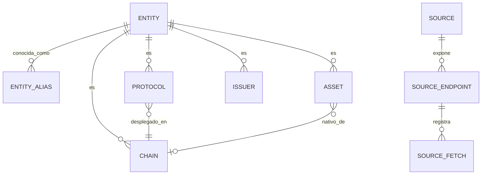

### `core.entity` ★
Tabla maestra de identidad. Reemplaza el `HistoryTarget` del código: cualquier fila del terminal es una `entity` y por eso puede abrir la ficha lateral.

| Columna | Tipo | Notas |
| --- | --- | --- |
| `id` | `uuid` PK | |
| `kind` | `enum` | `chain`, `protocol`, `asset`, `stablecoin`, `yield_pool`, `rwa_sector`, `rwa_class`, `quote`, `ticker`, `issuer`, `league`, `jurisdiction`, `network_build` |
| `slug` | `text` | id natural: `aave`, `bitcoin`, `ethereum` |
| `name` | `text` | |
| `symbol` | `text` \| null | |
| `logo_url` | `text` | |
| `is_active` | `bool` | |
| UNIQUE | `(kind, slug)` | |

### `core.entity_alias`
| `entity_id` | `source_id` | `external_id` | `external_name` | UNIQUE `(source_id, external_id)` |

Aquí viven los `keys: {llama, growthepie, l2beat, bbi}` de `networks.json` y el `geckoId` de los protocolos.

### `core.chain`
| `entity_id` PK/FK | `layer` (`L1`\|`L2`) | `kind` | `vm` (`EVM`,`zkEVM`,`SVM`,`Move VM`,`WASM`,`TVM`) | `language` | `settles_on_entity_id` FK | `gas_token_entity_id` FK | `launched_year` | `block_time_sec` | `finality_sec` | `finality_note` | `fee_model` | `docs_url` | `faucet_url` | `grants_url` | `repo_url` |

### `core.protocol`
| `entity_id` PK/FK | `category` | `primary_chain_entity_id` FK | `token_entity_id` FK | `url` |

### `core.asset`
| `entity_id` PK/FK | `asset_type` (`coin`,`token`,`stablecoin`,`fan_token`,`etf`,`equity`,`index`) | `native_chain_entity_id` FK | `max_supply` | `coingecko_id` |

### `core.issuer`
| `entity_id` PK/FK | `legal_name` | `jurisdiction` | `custodian` | `type` (`fintech`,`bank`,`asset_manager`,`daO`) |

### `core.source`
| Columna | Ejemplo |
| --- | --- |
| `id` `text` PK | `defillama`, `coingecko`, `yahoo`, `coinmetrics`, `growthepie`, `l2beat`, `github`, `dune`, `messari`, `nansen`, `cryptocom`, `binance_futures`, `bybit`, `blockscout`, `alternative_me`, `bcb`, `rss_press`, `google_news_bo`, `blockfinity_curated` |
| `name` | "DeFiLlama" |
| `base_url` | |
| `requires_key` | `bool` |
| `key_env_var` | `DUNE_API_KEY` |
| `rate_limit_per_hour` | `int` |
| `is_scraped` | `bool` — `true` para los dos parsers de `__NEXT_DATA__` |
| `reliability` | `enum` (`official_api`,`community_api`,`scrape`,`curated`) |
| `license_note` | `text` |

### `core.source_endpoint`
| `id` | `source_id` | `path` | `method` | `default_ttl_seconds` | `failure_ttl_seconds` | `persist_snapshot` |

### `core.source_fetch` ★
Una fila por consulta real a una fuente. **Todo hecho apunta acá.** Reemplaza el `fetchedAt`/`stale` que hoy viaja en cada payload.

| `id` `bigserial` | `endpoint_id` | `requested_at` | `completed_at` | `ok` `bool` | `http_status` | `stale` `bool` | `error` `text` | `rows_returned` | `cache_hit` `bool` | `duration_ms` |

---

## 6. Tablas por módulo

### 6.1 Módulo `defi_protocols` — Protocol Analytics

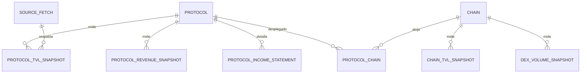

**`defi.protocol_tvl_snapshot`** — lo que muestra el bloque "Top protocolos"

| Columna | Tipo |
| --- | --- |
| `protocol_entity_id` FK, `as_of` `date` | PK compuesta |
| `tvl_usd` | `numeric(24,2)` |
| `change_1d_pct`, `change_7d_pct`, `change_30d_pct` | `numeric(10,4)` NULL |
| `category`, `primary_chain` | `text` |
| `rank` | `int` |
| `source_fetch_id` | FK |

**`defi.protocol_revenue_snapshot`**
`protocol_entity_id`, `as_of`, `revenue_24h_usd`, `revenue_7d_usd`, `revenue_30d_usd`, `fees_24h_usd`, `category`, `source_fetch_id`

**`defi.protocol_income_statement`**
`protocol_entity_id`, `as_of`, `period` (`24h`,`7d`,`30d`,`1y`), `fees_usd`, `revenue_usd`, `holders_revenue_usd`, `supply_side_revenue_usd`, `earnings_usd`, `source_fetch_id`

**`defi.chain_tvl_snapshot`**
`chain_entity_id`, `as_of`, `tvl_usd`, `change_1d_pct`, `change_7d_pct`, `protocols_count`, `source_fetch_id`

**`defi.chain_tvl_daily`** — serie larga (hoy `getChainTvlHistory`)
`chain_entity_id`, `date`, `tvl_usd` · PK `(chain_entity_id, date)` · particionada por año

**`defi.dex_volume_snapshot`**
`scope` (`global`\|`chain`\|`protocol`), `scope_entity_id`, `as_of`, `volume_24h_usd`, `volume_7d_usd`, `change_7d_pct`, `source_fetch_id`

**`defi.protocol_chain`** — n:m
`protocol_entity_id`, `chain_entity_id`, `tvl_usd`, `as_of`

**Vista derivada** `defi.vw_movers` reemplaza al cálculo en memoria: gainers/losers 7d con filtro TVL > 50 M y |cambio| < 500 %.

---

### 6.2 Módulo `defi_yields` — DeFi Yields

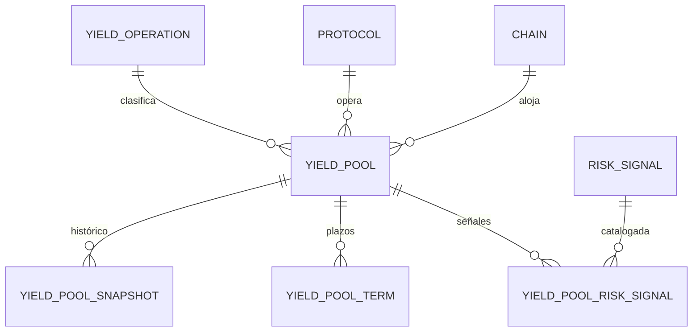

**`defi.yield_operation`** — catálogo (hoy `OPERATIONS` en `lib/yields.ts`)
`id` (`lend`,`stake`,`restake`,`dollar`,`rwa`,`liquidity`,`fixed`,`vault`,`other`), `label`, `description`, `sort_order`

**`defi.yield_pool`** — dimensión
`entity_id` PK/FK, `external_pool_id` (uuid de DeFiLlama), `protocol_entity_id` FK, `chain_entity_id` FK, `symbol`, `operation_id` FK, `category`, `is_stablecoin` `bool`, `il_risk` `bool`, `exposure` (`single`\|`multi`), `meta`, `reward_tokens` `text[]`, `first_seen`, `last_seen`

**`defi.yield_pool_snapshot`** — la serie que alimenta el gráfico del pool
`pool_entity_id`, `date` · PK · `apy`, `apy_base`, `apy_reward`, `apy_mean_30d`, `apy_change_7d_pp`, `apy_change_30d_pp`, `tvl_usd`, `apy_borrow`, `utilization_pct`, `ltv_pct`, `borrowable` `bool`, `is_outlier` `bool`, `prediction_direction`, `prediction_probability`, `source_fetch_id`

**`defi.yield_pool_term`**
`pool_entity_id`, `kind` (`maturity`\|`exit`\|`lock`), `label`, `days`, `maturity_date`

**`defi.risk_signal`** — catálogo de reglas
`id`, `label`, `description`, `weight_points`, `level_contribution`

**`defi.yield_pool_risk_signal`**
`pool_entity_id`, `signal_id`, `as_of`, `is_active`

**`defi.yield_pool_risk`** — resultado
`pool_entity_id`, `as_of`, `level` (`low`,`medium`,`high`), `points`, `methodology_version`

**`defi.yield_pulse_snapshot`** — la tarjeta de cabecera
`as_of`, `dollar_median_apy`, `dollar_pools`, `eth_staking_pool_id`, `eth_staking_apy`, `sol_staking_pool_id`, `sol_staking_apy`, `btc_median_apy`, `btc_pools`

---

### 6.3 Módulo `stablecoins` — Stablecoin Intelligence

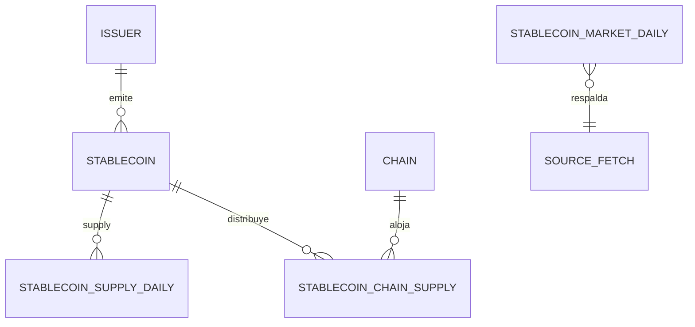

**`market.stablecoin`**
`entity_id` PK/FK, `external_id` (id numérico de DeFiLlama), `symbol`, `peg_mechanism` (`fiat-backed`,`crypto-backed`,`algorithmic`), `peg_asset` (`USD`,`EUR`…), `issuer_entity_id` FK, `launched_at`

**`market.stablecoin_supply_daily`**
`stablecoin_entity_id`, `date` · PK · `circulating_usd`, `change_7d_pct`, `source_fetch_id`

**`market.stablecoin_chain_supply`**
`stablecoin_entity_id`, `chain_entity_id`, `date` · PK · `circulating_usd`

**`market.chain_stablecoin_daily`** — total por red
`chain_entity_id`, `date`, `circulating_usd`, `assets_count`

**`market.stablecoin_market_daily`** — la cifra oficial de cabecera
`date` PK, `total_usd`, `attributed_usd`, `chain_count`, `chain_coverage_pct`, `chain_breakdown_available` `bool`, `change_1d_pct`, `change_7d_pct`, `change_30d_pct`, `dominant_symbol`, `dominance_pct`, `methodology`, `source_fetch_id`

---

### 6.4 Módulo `market` — Crypto Markets

**`market.asset_market_snapshot`** — alimenta el screener y las tarjetas
`asset_entity_id`, `as_of` · PK · `rank`, `price_usd`, `market_cap_usd`, `fdv_usd`, `volume_24h_usd`, `turnover_24h_pct`, `dominance_pct`, `high_24h_usd`, `low_24h_usd`, `change_1h_pct`, `change_24h_pct`, `change_7d_pct`, `change_30d_pct`, `ath_usd`, `ath_drawdown_pct`, `circulating_supply`, `max_supply`, `float_pct`, `image_url`, `source_fetch_id`

**`market.asset_price_daily`** — histórico 365 d de CoinGecko
`asset_entity_id`, `date` · PK · `price_usd`, `market_cap_usd`, `volume_24h_usd`

**`market.ticker_instrument`** — pares de exchange
`id` (`BTC_USDT`), `base_entity_id`, `quote_symbol`, `venue` (`cryptocom`,`binance`)

**`market.ticker_snapshot`**
`instrument_id`, `as_of`, `last_price`, `change_24h_pct`, `high_24h`, `low_24h`, `volume_24h_usd`

**`market.candle_daily`**
`instrument_id`, `date` · PK · `open`, `high`, `low`, `close`, `volume`

**`market.global_snapshot`**
`as_of` PK, `total_market_cap_usd`, `total_volume_24h_usd`, `btc_dominance_pct`, `eth_dominance_pct`, `market_cap_change_24h_pct`

**`market.fear_greed_daily`**
`date` PK, `value` (0–100), `classification`

**`market.performance_run`** / **`market.performance_point`**
Para el gráfico de rendimiento relativo: `run_id`, `days`, `generated_at` → `run_id`, `asset_entity_id`, `date`, `indexed_value`, más `return_pct`, `max_drawdown_pct`, `volatility_ann_pct` por activo.

---

### 6.5 Módulo `onchain` — Bitcoin & On-chain

**`onchain.btc_daily`** — 20 métricas de Coin Metrics
`date` PK, `price_usd`, `mvrv`, `market_cap_usd`, `realized_cap_usd`, `realized_price_usd`, `unrealized_gain_usd`, `supply_btc`, `exchange_supply_btc`, `exchange_supply_pct`, `exchange_inflow_usd`, `exchange_outflow_usd`, `net_exchange_flow_usd`, `addresses_with_balance`, `active_addresses`, `transactions`, `hash_rate_eh`, `fees_btc`, `roi_30d_pct`, `is_preliminary` `bool`, `source_fetch_id`

**`onchain.btc_signal_snapshot`**
`as_of`, `profitable_days_pct`, `mvrv_30d_change`, `address_balance_30d_change_pct`, `exchange_supply_7d_change_btc`, `exchange_supply_30d_change_btc`, `net_exchange_flow_7d_usd`

**`onchain.network_activity_daily`**
`asset_entity_id` (BTC/ETH), `date` · PK · `active_addresses`, `transactions`

**`onchain.eth_stats_snapshot`**
`as_of`, `total_transactions`, `transactions_today`, `total_addresses`, `avg_block_time_ms`, `gas_price_slow_gwei`, `gas_price_average_gwei`, `gas_price_fast_gwei`, `eth_price_usd`

**`onchain.btc_derivatives_snapshot`**
`as_of` PK, `mark_price_usd`, `index_price_usd`, `funding_rate_pct`, `funding_annualized_pct`, `next_funding_time`, `open_interest_usd`, `open_interest_btc`, `oi_24h_change_pct`, `global_long_pct`, `top_trader_long_pct`, `taker_buy_pct`

**`onchain.btc_derivatives_point`** (serie 168 h) · **`onchain.liquidation_scenario`** (`as_of`, `leverage`, `distance_pct`, `long_liq_usd`, `short_liq_usd`)

**`onchain.liquidation_event`** — el WebSocket de Bybit, si se decide persistir
`id`, `received_at`, `side`, `price`, `size_btc`, `notional_usd`, `symbol` · retención corta (7 días)

**`onchain.smart_money_flow`**
`as_of`, `token_symbol`, `chain_entity_id`, `net_flow_24h_usd`, `net_flow_7d_usd`, `trader_count`

**`onchain.dex_trade`** (Dune)
`trade_time`, `chain_entity_id`, `project`, `pair`, `bought_amount`, `bought_symbol`

---

### 6.6 Módulo `bbi` — Blockchain Intelligence / Scorecard

Este es el módulo con más valor propietario, así que el modelo separa **insumo curado**, **insumo observado** y **resultado calculado**.

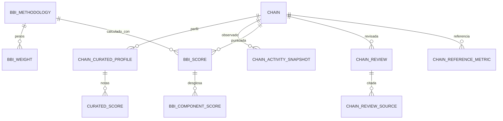

**`curated.chain_profile`** — versionado del `blockchains.json`
`id`, `chain_entity_id` FK, `version`, `valid_from`, `valid_to`, `group`, `type`, `launch_year`, `consensus`, `traceability`, `privacy`, `monitoring`, `institutional_adoption`, `regulatory_risk`, `main_use_cases`, `ecosystem_maturity`, `note`, `tvl_excluded_reason`, `as_of`, `author_id`, `approved_by`, `approved_at`

**`curated.chain_score`** — las 7 notas editoriales
`profile_id` FK, `dimension` (`seguridad`,`adopcion`,`actividadEconomica`,`escalabilidad`,`ecosistema`,`institucional`,`compliance`), `value` `numeric(4,2)` · PK `(profile_id, dimension)`

**`curated.chain_review`** / **`curated.chain_review_source`**
`id`, `chain_entity_id`, `reviewed_at`, `rationale` → `review_id`, `label`, `url`

**`curated.chain_reference_metric`**
`chain_entity_id`, `label`, `value_usd`, `period`, `published_at`, `source_name`, `url`, `note`

**`derived.bbi_methodology`**
`version` PK (`v2`), `effective_from`, `description`, `activity_weight_pct` (40), `editorial_weight_pct` (60), `min_indicators` (3), `min_coverage_pct` (60), `doc_url`

**`derived.bbi_weight`**
`methodology_version`, `dimension`, `weight_pct` · PK compuesta · (seguridad 15, adopción 10, actividad 40, escalabilidad 10, ecosistema 10, institucional 10, compliance 5)

**`derived.bbi_activity_weight`**
`methodology_version`, `metric_id` (`active_addresses` 30, `stablecoin_supply` 25, `tvl` 20, `dex_volume` 15, `chain_fees` 10), `weight_pct`, `log_anchor_min`, `log_anchor_max`

**`market.chain_activity_snapshot`** — insumo observado
`chain_entity_id`, `as_of` · PK · `active_addresses_24h`, `tvl_usd`, `stablecoin_mcap_usd`, `dex_volume_24h_usd`, `dex_volume_7d_usd`, `fees_24h_usd`, `fees_7d_usd`, `source_fetch_id`

**`derived.bbi_score`** ★
`chain_entity_id`, `as_of`, `methodology_version` · PK · `score` `numeric(4,2)`, `is_partial` `bool`, `activity_coverage_pct`, `activity_score`, `editorial_score`, `rank`, `rank_comparable` `bool`, `computed_at`

**`derived.bbi_component_score`**
`chain_entity_id`, `as_of`, `component_id`, `raw_value`, `normalized`, `weight_pct`, `available` `bool`

**`derived.use_case_recommendation`**
`as_of`, `use_case` (`Pagos`,`Tokenización`,`Compliance`), `leader_chain_entity_id`, `score`, `rationale`, `alternatives` `text[]`

---

### 6.7 Módulo `build_cost` — Builder Radar

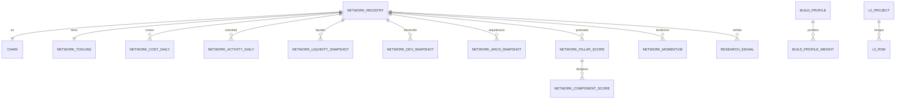

**`curated.network_registry`** — las 15 redes de `networks.json`; los campos técnicos ya están en `core.chain`, aquí van los del módulo: `tech_reviewed_at`, `repo_note`, `is_active`

**`curated.network_tooling`**
`chain_entity_id` PK, `evm` `bool`, `foundry`, `hardhat`, `remix`, `account_abstraction` `text`, `oracles` `text[]`, `indexers` `text[]`, `wallets` `text[]`, `sdks` `text[]`

**`build.network_cost_daily`**
`chain_entity_id`, `date` · PK · `median_tx_cost_usd`, `source_fetch_id` — los avg/min/max/volatilidad 7-30-90 d salen de vistas agregadas, no se guardan pre-calculados

**`build.network_activity_daily`**
`chain_entity_id`, `date` · PK · `daily_active_addresses`, `tx_count`, `observed_tps`, `throughput_gas_per_sec`

**`build.network_liquidity_snapshot`**
`chain_entity_id`, `as_of` · `tvl_usd`, `tvl_change_7d/30d/90d_pct`, `stablecoin_usd`, `dex_volume_24h_usd`, `dex_volume_7d_usd`, `chain_fees_24h_usd`, `protocols_count`

**`build.network_rwa_snapshot`**
`chain_entity_id`, `as_of`, `rwa_protocol_count`, `rwa_tvl_usd`, `note`

**`build.network_dev_snapshot`** (GitHub)
`chain_entity_id`, `as_of`, `repo`, `commits_4w`, `commits_12w`, `commits_52w`, `commits_prev_12w`, `commits_change_pct`, `stars`, `forks`, `open_issues`, `contributors`, `pushed_at`, `ecosystem_developers`, `ecosystem_developers_source`, `unavailable`

**`build.l2_project`** (L2BEAT)
`chain_entity_id`, `as_of`, `stage`, `category`, `data_availability`, `vm`, `host_chain`, `providers` `text[]`, `under_review` `bool`

**`build.l2_risk`**
`chain_entity_id`, `as_of`, `name`, `value`, `sentiment`, `description`

**`derived.build_pillar`** / **`derived.build_component`** — catálogo de pilares y componentes con su definición y fuente

**`derived.build_profile`** — los perfiles/casos de uso
`id`, `label`, `question` · **`derived.build_profile_weight`**: `profile_id`, `pillar_id`, `weight`; **`derived.build_profile_emphasis`**: `profile_id`, `component_id`, `multiplier`

**`derived.network_pillar_score`**
`chain_entity_id`, `as_of`, `profile_id`, `pillar_id` · PK · `score`, `weight`, `coverage_pct`

**`derived.network_component_score`**
`chain_entity_id`, `as_of`, `component_id`, `raw`, `normalized`, `weight`, `available`

**`derived.network_momentum`**
`chain_entity_id`, `as_of`, `score`, `raw_growth_pct`, `size_factor`, `signal`, `is_emerging` `bool` + tabla hija `network_momentum_part`

**`derived.research_signal`**
`id`, `chain_entity_id`, `as_of`, `signal`, `interpretation` + hija `research_signal_datum` (`label`, `value`, `direction`)

---

### 6.8 Módulo `tokenization` — Tokenization Hub / RWA

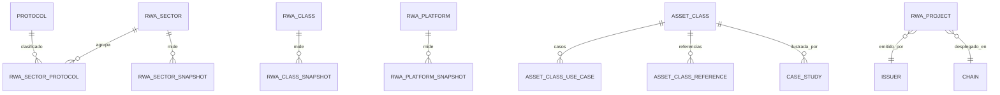

**`curated.rwa_sector`** — los 7 sectores del `sectorMap`
`id`, `name`, `description`, `sort_order`, `valid_from`, `valid_to`

**`curated.rwa_sector_protocol`** — la clasificación propia
`sector_id`, `protocol_entity_id`, `assigned_by`, `assigned_at`, `rationale`

**`tokenization.rwa_sector_snapshot`**
`sector_id`, `as_of` · PK · `tvl_usd`, `share_pct`, `change_7d_pct`, `protocols_count`, `top_protocols` `text[]`, `coverage_pct`

**`tokenization.rwa_class_snapshot`** — clases del dashboard RWA
`class_name`, `as_of`, `active_mcap_usd`, `onchain_mcap_usd`, `defi_active_tvl_usd`, `assets_count`, `inclusion_flags` `jsonb` (`includeStablecoins`, `includeGovernance`, `includeRwaPerps`, `includeWrappers`)

**`tokenization.rwa_platform_snapshot`**
`platform_name`, `as_of`, `active_mcap_usd`, `assets_count`

**`tokenization.rwa_market_context`**
`as_of` PK, `total_rwa_onchain_usd`, `tokenized_treasuries_usd`, `source_name`, `source_url`

**`curated.asset_class`** — las 7 clases de activo
`slug` PK, `name`, `icon`, `what_is_tokenized`, `maturity`, `maturity_score`, `infrastructure`, `bottleneck`, `bolivia_relevance`, `as_of`, `version`

**`curated.asset_class_use_case`** (`class_slug`, `sort_order`, `text`)
**`curated.asset_class_reference`** (`class_slug`, `name`, `url`, `note`)

**`curated.case_study`**
`id`, `name`, `issuer_entity_id`, `country`, `asset`, `asset_class_slug`, `chain_entity_id`, `status`, `llama_slug`, `size_note`, `model`, `lesson`, `source_name`, `source_url`, `verified_on`

**`curated.rwa_project`**
`id`, `name`, `issuer_entity_id`, `asset`, `category`, `chain_entity_id`, `value_usd`, `value_as_of`, `custodian`, `jurisdiction`, `source_name`, `source_url`

---

### 6.9 Módulo `regulation` — CBDC & Regulación / Bolivia

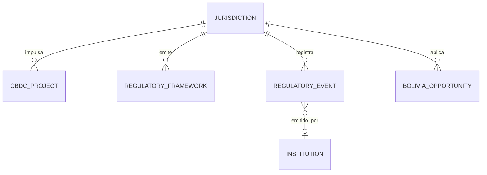

**`core.jurisdiction`**
`id` (ISO-3166), `name`, `region`, `central_bank`, `lat`, `lon`

**`regulation.cbdc_project`**
`jurisdiction_id`, `project`, `status` (`research`,`proof_of_concept`,`pilot`,`launched`,`cancelled`), `since`, `note`, `as_of`, `source_name`, `source_url`

**`regulation.cbdc_global_context`**
`as_of` PK, `exploring`, `pilots`, `advanced_phase`, `note`, `source_name`, `source_url`

**`regulation.framework`**
`id`, `name`, `jurisdiction_id`, `scope`, `status`, `note`, `as_of`, `source_name`, `source_url`

**`regulation.event`** ★ — unifica el timeline CBDC y el timeline boliviano
`id`, `scope` (`global`\|`bolivia`), `date`, `date_precision` (`day`,`month`,`quarter`,`year`), `title`, `institution`, `jurisdiction_id`, `category`, `summary`, `implications`, `source_name`, `source_url`, `verified_on`

**`curated.bolivia_opportunity`**
`slug`, `name`, `asset_class_slug` FK, `potencial` (1-5), `madurez`, `viabilidad`, `rationale`, `primer_paso`, `as_of`, `version` + hijas `bolivia_opportunity_enabler` y `bolivia_opportunity_blocker`

**`market.fx_rate_daily`** (BCB)
`date` PK, `official_bob_per_usd`, `cutoff_date`, `valid_from`
**`market.fx_bank_rate`**: `date`, `bank`, `buy_bob`, `amount_usd`, `transactions`

**`curated.partnership`**
`id`, `company_a`, `company_b`, `announced_on`, `chain_entity_id`, `use_case`, `status`, `source_name`, `source_url`

**`regulation.world_land_ring`** — la geometría del mapa
`ring_index` PK, `coordinates` `jsonb` (o `geometry(Polygon,4326)` con PostGIS), `source`, `simplification`

---

### 6.10 Módulo `security` — Exploits

**`security.hack_event`**
`id` PK, `occurred_on` `date`, `name`, `amount_usd` NULL, `returned_usd` NULL, `classification`, `technique`, `target_type`, `is_bridge_hack` `bool`, `language`, `source_fetch_id`, `source_url`

**`security.hack_event_chain`** — n:m
`hack_id`, `chain_entity_id`

**`security.hack_stats_daily`** — materializada, alimenta el gráfico de cadencia
`window_start`, `window_kind` (`week`\|`month`), `count`, `amount_usd`, `returned_usd`, `unpriced_count`

---

### 6.11 Módulo `news`

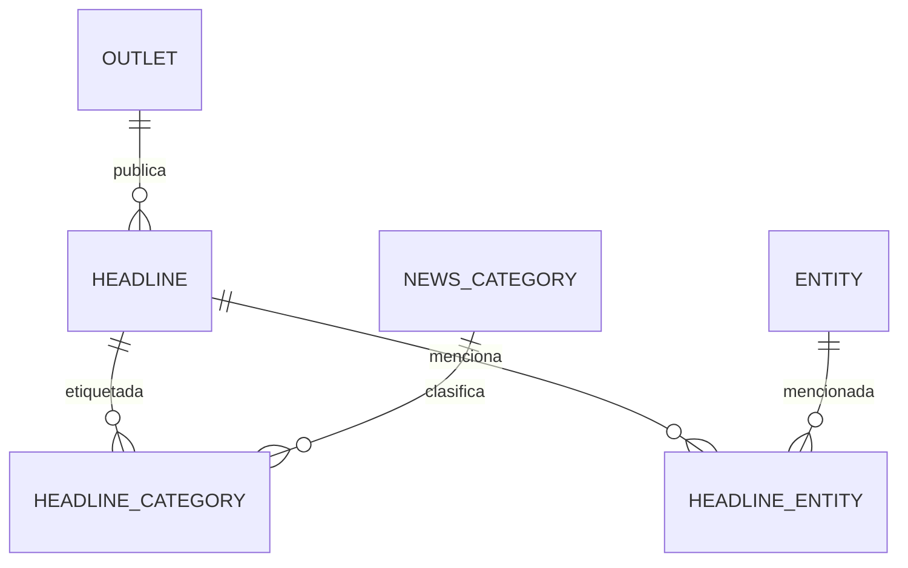

**`news.outlet`**: `id`, `name`, `feed_url`, `scope` (`global`\|`bolivia`), `language`, `is_active`
**`news.category`**: `id` (`pagos`, `banca`, `stablecoins`, `rwa`, `custodia`, `cbdc`, `regulacion`), `label`, `pattern` (el regex actual), `is_institutional`
**`news.headline`**: `id`, `outlet_id`, `title`, `url` UNIQUE, `published_at`, `institutional_score`, `fetched_at`, `is_noise` `bool`
**`news.headline_category`**: `headline_id`, `category_id`, `matched_by` (`regex`\|`manual`\|`llm`)
**`news.headline_entity`**: `headline_id`, `entity_id`, `confidence`

---

### 6.12 Módulo `capital_markets`

**`market.quote_symbol`**: `symbol` PK (`IBIT`, `COIN`, `^GSPC`), `entity_id` FK, `name`, `asset_type` (`etf`,`equity`,`index`,`commodity`,`fx`), `currency`, `venue`, `is_crypto_proxy` `bool`
**`market.quote_snapshot`**: `symbol`, `as_of`, `price`, `change_1d_pct`, `change_7d_pct`, `change_30d_pct`, `volume`, `turnover_usd`
**`market.quote_daily`**: `symbol`, `date` · PK · `close` — serie 5 años

---

### 6.13 Módulo `fan_tokens`

**`curated.league`**: `id`, `name`, `country`, `sport`, `sort_order`
**`market.fan_token`**: `entity_id` PK/FK, `league_id`, `club_name`
**`market.fan_token_snapshot`**: `entity_id`, `as_of`, `price_usd`, `market_cap_usd`, `volume_24h_usd`, `change_24h_pct`, `change_7d_pct`
**`derived.league_snapshot`**: `league_id`, `as_of`, `market_cap_usd`, `volume_24h_usd`, `share_pct`, `change_7d_pct`, `tokens_count`, `top_tokens` `text[]`

---

### 6.14 Módulo `indices` — Índices propietarios

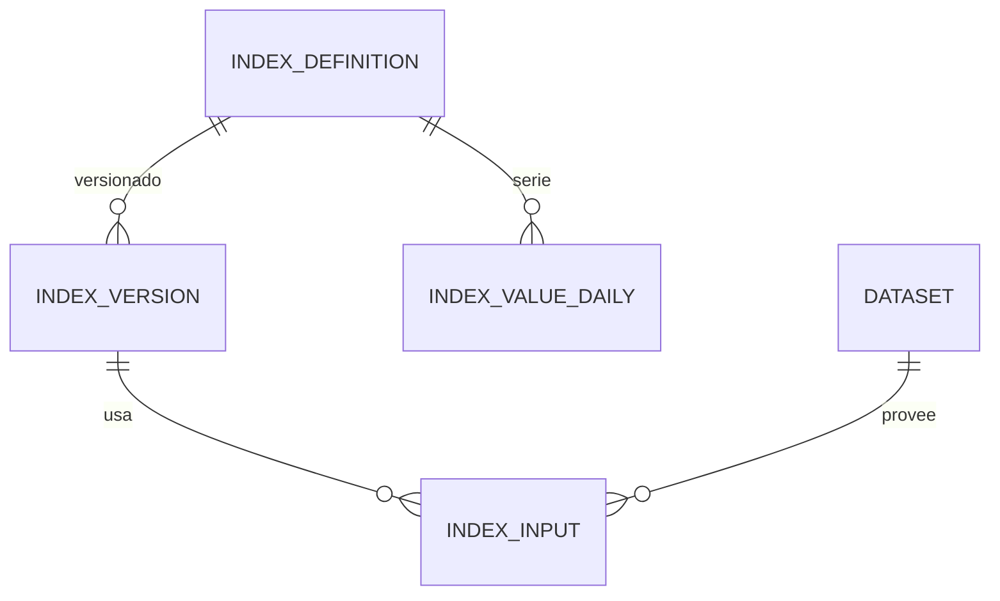

**`derived.index_definition`**
`code` PK (`BSI`, `RWA_TVL`, `TPA`, `CBI`, `CBP`, `CMI`, `MRI`), `name`, `family` (`Tokenización`,`Stablecoins`,`Institucional`,`Riesgo`), `unit` (`base100`,`score`,`usd`), `higher_is_better` `bool`, `description`

**`derived.index_version`**
`code`, `version`, `effective_from`, `methodology` `text`, `formula` `text`, `approved_by`

**`derived.index_input`**
`code`, `version`, `dataset_id` FK, `metric_id` FK, `weight`, `transform` (`log`,`zscore`,`rebase100`,`none`)

**`derived.index_value_daily`** ★
`code`, `date`, `version` · PK · `value`, `change_1d_pct`, `change_7d_pct`, `change_30d_pct`, `signal_label`, `signal_tone`, `is_partial` `bool`, `computed_at`

---

### 6.15 Módulo `correlations`

**`derived.correlation_run`**: `id`, `generated_at`, `window_days`, `method` (`pearson_log_returns`), `asset_count`
**`derived.correlation_pair`**: `run_id`, `a_entity_id`, `b_entity_id`, `coefficient`, `observations` · PK `(run_id, a_entity_id, b_entity_id)`

---

### 6.16 Módulo `nexum` — Aula

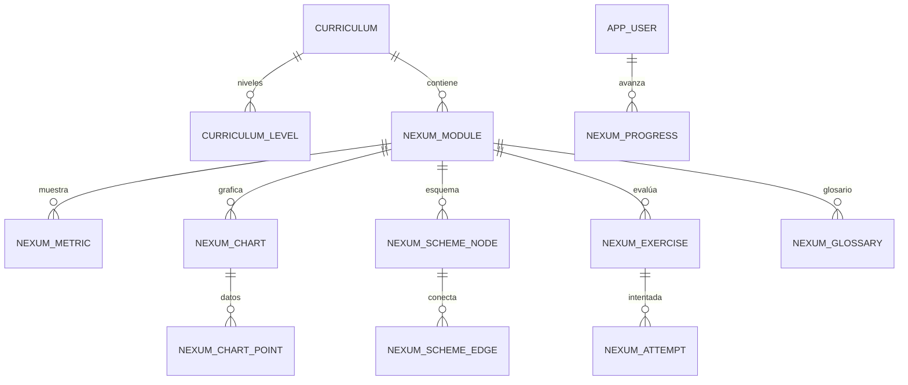

**`nexum.curriculum`**: `version`, `snapshot_date`, `snapshot_label`, `snapshot_note`, `is_published`
— el `instructorPin` **desaparece**: el modo instructor pasa a ser el rol `instructor` en `access.user_role`.

**`nexum.level`**: `curriculum_version`, `xp_threshold`, `title`, `note`
**`nexum.module`**: `id`, `curriculum_version`, `code`, `sort_order`, `title`, `subtitle`, `vertical`, `target_view_id` FK → `catalog.view`, `stage`, `duration_min`, `concept_what`, `concept_read`, `concept_why`
**`nexum.metric`**: `module_id`, `id`, `label`, `value`, `unit`, `delta_pct`, `hint`, `is_live`, `is_proprietary`, `dataset_id` FK (si es live)
**`nexum.chart`** / **`nexum.chart_point`** / **`nexum.chart_annotation`**
**`nexum.scheme_node`** (`id`,`label`,`sub`,`kind`,`col`,`row`) / **`nexum.scheme_edge`** (`from_node`,`to_node`,`label`)
**`nexum.exercise`**: `id`, `module_id`, `prompt`, `kind`, `answer` `jsonb`, `xp`, `explanation`
**`nexum.glossary`**: `module_id`, `term`, `definition`
**`userspace.nexum_progress`**: `user_id`, `curriculum_version`, `xp`, `updated_at`
**`userspace.nexum_attempt`**: `user_id`, `exercise_id`, `attempts`, `is_correct`, `was_revealed`, `first_solved_at`
**`userspace.nexum_module_visit`**: `user_id`, `module_id`, `first_visit_at`, `last_visit_at`

---

## 7. `userspace` — artefactos del usuario

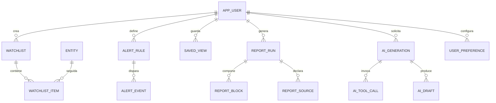

| Tabla | Columnas clave |
| --- | --- |
| `userspace.watchlist` | `id`, `user_id`, `name`, `is_default`, `created_at` |
| `userspace.watchlist_item` | `watchlist_id`, `entity_id`, `note`, `sort_order`, `added_at` |
| `userspace.alert_rule` | `id`, `user_id`, `entity_id`, `metric_id`, `operator` (`gt`,`lt`,`change_pct_abs`,`crosses`), `threshold`, `window`, `channel` (`email`,`webhook`,`in_app`), `is_active` |
| `userspace.alert_event` | `id`, `rule_id`, `fired_at`, `observed_value`, `payload` `jsonb`, `delivered_at`, `delivery_status` |
| `userspace.saved_view` | `id`, `user_id`, `view_id` FK, `name`, `filters` `jsonb`, `is_shared` |
| `userspace.user_preference` | `user_id`, `key`, `value` `jsonb` — reemplaza `bf-nav-collapsed` y compañía |
| `userspace.report_run` | `id`, `user_id`, `kind` (`landscape`,`weekly`,`custom`), `generated_at`, `status`, `params` `jsonb`, `pdf_url` |
| `userspace.report_block` | `run_id`, `block_id` FK, `payload` `jsonb`, `ok`, `stale` — la foto congelada del informe |
| `userspace.report_source` | `run_id`, `source_id`, `fetched_at`, `ok`, `stale` |
| `userspace.ai_generation` | `id`, `user_id`, `mode` (`report`,`carousel`), `model`, `tema`, `audiencia`, `instrucciones`, `status`, `iterations`, `input_tokens`, `output_tokens`, `cache_read_tokens`, `cost_usd`, `started_at`, `finished_at`, `error` |
| `userspace.ai_tool_call` | `generation_id`, `sequence`, `tool_name`, `input` `jsonb`, `ok`, `duration_ms` |
| `userspace.ai_draft` | `id`, `generation_id`, `version`, `content_md`, `edited_by`, `status` (`draft`,`reviewed`,`published`), `reviewed_at` |
| `userspace.export_job` | `id`, `user_id`, `dataset_id`, `format` (`csv`,`png`,`xlsx`,`pdf`), `filters` `jsonb`, `status`, `file_url`, `expires_at` |

---

## 8. `ops` — ingesta, cache y calidad

| Tabla | Para qué |
| --- | --- |
| `ops.ingestion_job` | `id`, `source_endpoint_id`, `dataset_id`, `cron`, `ttl_seconds`, `is_active`, `priority` — reemplaza el TTL implícito de `lib/cache.ts` |
| `ops.ingestion_run` | `id`, `job_id`, `started_at`, `finished_at`, `status`, `rows_inserted`, `rows_updated`, `error`, `source_fetch_id` |
| `ops.cache_entry` | `key` PK, `value` `jsonb`, `fetched_at`, `expires_at`, `is_stale` — solo si se decide mantener un cache en base además de Redis |
| `ops.data_quality_flag` | `id`, `table_name`, `record_pk`, `rule` (`null_spike`, `outlier`, `stale_source`, `coverage_below_min`), `severity`, `detected_at`, `resolved_at` |
| `ops.audit_log` | `id`, `actor_user_id`, `action`, `object_kind`, `object_id`, `before` `jsonb`, `after` `jsonb`, `at`, `ip_hash` |
| `ops.schema_version` | migraciones |

---

## 9. Funciones, vistas y triggers

### 9.1 Acceso — el núcleo funcional

```sql
-- ¿Puede este usuario hacer esta acción sobre este objeto?
CREATE FUNCTION access.fn_can(
  p_user_id   uuid,
  p_object_kind access.object_kind,
  p_object_id text,
  p_action    access.action_kind DEFAULT 'view'
) RETURNS boolean;

-- Todos los permisos efectivos de un usuario, ya resueltos y con herencia.
CREATE FUNCTION access.fn_effective_entitlements(p_user_id uuid)
RETURNS TABLE (
  object_kind access.object_kind,
  object_id   text,
  action      access.action_kind,
  constraints jsonb,
  granted_via text        -- 'user' | 'org' | 'role:analyst' | 'plan:pro'
);

-- Los constraints combinados que aplican a un dataset para un usuario
-- (el más restrictivo gana en cada clave).
CREATE FUNCTION access.fn_constraints(p_user_id uuid, p_dataset_id text)
RETURNS jsonb;

-- El sidebar del usuario: grupos, módulos y vistas que puede ver, ordenados.
CREATE VIEW access.vw_user_navigation AS ...;   -- parametrizada vía RLS o fn

-- Registro de acceso: se llama desde el resolver de cada dataset.
CREATE FUNCTION access.fn_log_access(
  p_user_id uuid, p_dataset_id text, p_action access.action_kind,
  p_allowed boolean, p_reason text
) RETURNS void;
```

### 9.2 Catálogo

```sql
-- Bloques de una vista que el usuario puede ver, con su dataset resuelto.
CREATE FUNCTION catalog.fn_view_blocks(p_user_id uuid, p_view_id text)
RETURNS TABLE (block_id text, kind text, title text, lead text,
               component text, layout jsonb, datasets text[], constraints jsonb);

-- Frescura declarada vs. real de un dataset (alimenta el SourceBadge).
CREATE FUNCTION catalog.fn_dataset_freshness(p_dataset_id text)
RETURNS TABLE (fetched_at timestamptz, is_stale boolean,
               cadence text, source_name text, source_url text);
```

### 9.3 Series e histórico — reemplaza `/api/history`

```sql
-- El resolutor único. Sustituye a lib/history.ts.
CREATE FUNCTION core.fn_entity_series(
  p_entity_id uuid,
  p_metric_id text,
  p_from date,
  p_to   date,
  p_user_id uuid DEFAULT NULL       -- aplica history_days del entitlement
) RETURNS TABLE (date date, value numeric);

-- Composición de un agregado (los protocolos que explican un sector RWA).
CREATE FUNCTION core.fn_entity_composition(
  p_entity_id uuid, p_as_of date, p_top int DEFAULT 5
) RETURNS TABLE (member_entity_id uuid, label text, value_usd numeric,
                 share_pct numeric, is_rest boolean);

-- Dos series rebaseadas a 100 en su primer día común (el "TVL vs precio").
CREATE FUNCTION core.fn_rebase_pair(
  p_left_entity uuid, p_left_metric text,
  p_right_entity uuid, p_right_metric text,
  p_from date, p_to date
) RETURNS TABLE (date date, left_idx numeric, right_idx numeric);

-- Último snapshot vigente de cualquier dimensión (patrón repetido).
CREATE FUNCTION core.fn_latest(p_table regclass, p_entity_id uuid)
RETURNS jsonb;
```

### 9.4 Cálculo propietario

```sql
-- Recalcula el BBI de una fecha con una versión de metodología y lo persiste.
CREATE FUNCTION derived.fn_compute_bbi(p_as_of date, p_version text DEFAULT 'v2')
RETURNS TABLE (chain_entity_id uuid, score numeric, is_partial boolean,
               coverage_pct numeric);

-- Normalización logarítmica con anclas fijas (hoy en lib/bbiMethodology.ts).
CREATE FUNCTION derived.fn_log_normalize(p_value numeric, p_min numeric, p_max numeric)
RETURNS numeric IMMUTABLE;

-- Índices propietarios.
CREATE FUNCTION derived.fn_compute_index(p_code text, p_date date) RETURNS numeric;

-- Scoring Build & Cost para un perfil.
CREATE FUNCTION derived.fn_score_networks(p_as_of date, p_profile_id text)
RETURNS TABLE (chain_entity_id uuid, score numeric, coverage_pct numeric,
               top_driver text, drag text);

-- Momentum y señales.
CREATE FUNCTION derived.fn_compute_momentum(p_as_of date) RETURNS void;

-- Riesgo de un pool (las reglas de lib/yields.ts).
CREATE FUNCTION defi.fn_assess_pool_risk(p_pool_entity_id uuid, p_as_of date)
RETURNS TABLE (level text, points int, signals text[]);

-- Correlaciones.
CREATE FUNCTION derived.fn_compute_correlations(p_window_days int) RETURNS uuid;
```

### 9.5 Ingesta

```sql
CREATE FUNCTION ops.fn_start_run(p_job_id uuid) RETURNS uuid;
CREATE FUNCTION ops.fn_finish_run(p_run_id uuid, p_status text,
                                  p_rows int, p_error text) RETURNS void;
-- Upsert idempotente de un snapshot con su trazabilidad.
CREATE FUNCTION ops.fn_upsert_snapshot(p_table regclass, p_rows jsonb,
                                       p_source_fetch_id bigint) RETURNS int;
-- Marca datos sospechosos (caída >90 % día a día, nulls masivos).
CREATE FUNCTION ops.fn_flag_quality(p_table regclass, p_as_of date) RETURNS int;
```

### 9.6 Triggers

| Trigger | Sobre | Efecto |
| --- | --- | --- |
| `trg_audit` | todas las tablas de `curated` y `access` | inserta en `ops.audit_log` |
| `trg_curated_version` | `curated.*` | cierra `valid_to` de la versión anterior al insertar una nueva |
| `trg_entity_touch` | `core.entity` | mantiene `updated_at` y `last_seen` |
| `trg_alert_eval` | `AFTER INSERT` en snapshots clave | evalúa `alert_rule` y encola `alert_event` |
| `trg_deny_wins` | `access.entitlement` | valida que no haya `allow` y `deny` idénticos en el mismo sujeto |

### 9.7 Row Level Security

```sql
ALTER TABLE defi.protocol_tvl_snapshot ENABLE ROW LEVEL SECURITY;

CREATE POLICY p_read ON defi.protocol_tvl_snapshot FOR SELECT
USING (
  access.fn_can(current_setting('app.user_id')::uuid,
                'dataset', 'defi.protocol_tvl_top', 'view')
);
```

Las tablas de `userspace` llevan siempre `USING (user_id = current_setting('app.user_id')::uuid)`.

---

## 10. Diagrama maestro (vista de 10.000 pies)

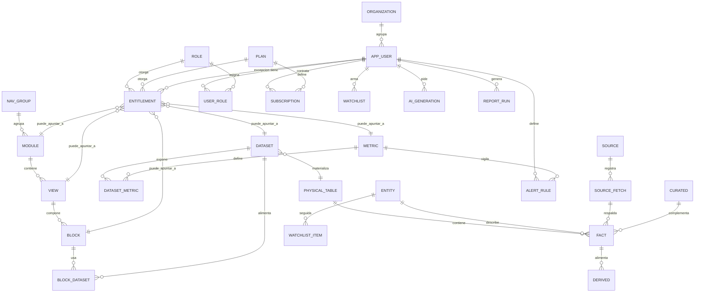

---

## 11. Mapeo: endpoint actual → tablas y funciones

| Endpoint hoy | Dataset del catálogo | Tablas / función |
| --- | --- | --- |
| `GET /api/defi/protocols` | `defi.protocol_tvl_top` | `defi.protocol_tvl_snapshot` |
| `GET /api/defi/movers` | `defi.movers` | vista `defi.vw_movers` |
| `GET /api/defi/revenue` | `defi.protocol_revenue` | `defi.protocol_revenue_snapshot` |
| `GET /api/defi/tvl-history` | `defi.tvl_history` | `defi.chain_tvl_daily` |
| `GET /api/defi/dex-volume` | `defi.dex_volume` | `defi.dex_volume_snapshot` |
| `GET /api/defi/income-statement` | `defi.income_statement` | `defi.protocol_income_statement` |
| `GET /api/yields` | `yields.universe` | `defi.yield_pool` + `yield_pool_snapshot` + `fn_assess_pool_risk` |
| `GET /api/yields/report` | `yields.pulse` | `defi.yield_pulse_snapshot` |
| `GET /api/stablecoins` | `stablecoins.overview` | `market.stablecoin_*` |
| `GET /api/market/assets` | `market.assets` | `market.asset_market_snapshot` |
| `GET /api/market/screener` | `market.screener` | `market.asset_market_snapshot` + `fn_constraints` (max_rows) |
| `GET /api/market/tickers` | `market.tickers` | `market.ticker_snapshot` |
| `GET /api/market/candles` | `market.candles` | `market.candle_daily` |
| `GET /api/market/performance` | `market.performance` | `market.performance_run/point` |
| `GET /api/onchain/bitcoin-intelligence` | `onchain.btc_intelligence` | `onchain.btc_daily` + `btc_derivatives_*` |
| `GET /api/onchain/eth-stats` | `onchain.eth_stats` | `onchain.eth_stats_snapshot` |
| `GET /api/onchain/network-activity` | `onchain.network_activity` | `onchain.network_activity_daily` |
| `GET /api/onchain/smart-money` | `onchain.smart_money` | `onchain.smart_money_flow` |
| `GET /api/blockchains` | `bbi.scorecard` | `derived.bbi_score` + `curated.chain_*` |
| `GET /api/networks` | `build.radar` | `derived.network_pillar_score` + bloques `build.*` |
| `GET /api/networks/prices` | `build.gas_token_prices` | `market.asset_price_daily` |
| `GET /api/tokenization/rwa` | `tokenization.rwa_overview` | `tokenization.rwa_sector_snapshot` + `rwa_class_snapshot` |
| `GET /api/capital-markets` | `capital.quotes` | `market.quote_snapshot` + `quote_daily` |
| `GET /api/cbdc` | `regulation.cbdc` | `regulation.cbdc_project` + `framework` + `event` |
| `GET /api/security/hacks` | `security.hacks` | `security.hack_event` + `hack_event_chain` |
| `GET /api/news/headlines` | `news.headlines` | `news.headline` + `headline_category` |
| `GET /api/news/institutional` | `news.institutional` | idem, filtrado por `is_institutional` |
| `GET /api/bolivia/news` | `bolivia.news` | `news.headline` con `outlet.scope='bolivia'` |
| `GET /api/fan-tokens` | `fan.leagues` | `derived.league_snapshot` + `market.fan_token_snapshot` |
| `GET /api/indices` | `indices.all` | `derived.index_value_daily` |
| `GET /api/correlations` | `market.correlations` | `derived.correlation_run/pair` |
| `GET /api/terminal/overview` \| `/pulse` \| `/radar` | `home.*` | vistas materializadas sobre varios módulos |
| `GET /api/insights` | `home.insights` | función `derived.fn_build_insights(as_of)` |
| `GET /api/history` | *transversal* | `core.fn_entity_series` + `fn_entity_composition` + `fn_rebase_pair` |
| `GET /api/report` | `report.landscape` | `userspace.report_run` + `report_block` |
| `GET /api/nexum/live` | `nexum.live_metrics` | `nexum.metric` con `dataset_id` resuelto |
| `POST /api/ai/generate` | `ai.generate` | `userspace.ai_generation` + `ai_tool_call` + `ai_draft` |

---

## 12. Convenciones técnicas

| Tema | Decisión |
| --- | --- |
| **Claves** | `uuid v7` para entidades nuevas; id natural `text` cuando la fuente ya da uno estable (slug DeFiLlama, id CoinGecko) |
| **Dinero** | `numeric(24,2)` para USD, `numeric(24,8)` para cripto. Nunca `float` |
| **Porcentajes** | `numeric(10,4)`. Los cambios de APY en **puntos porcentuales** llevan sufijo `_pp`, no `_pct` |
| **Fechas** | `date` para series diarias, `timestamptz` (UTC) para snapshots intradía. `as_of` = momento del dato; `fetched_at` = momento de la consulta |
| **Particionado** | Por rango de fecha (anual) en `*_daily` y `*_snapshot` de alta cardinalidad: `asset_price_daily`, `yield_pool_snapshot`, `network_cost_daily`, `btc_daily` |
| **Índices** | `(entity_id, date DESC)` en toda serie; `GIN` sobre `constraint_json`, `layout`, `filters`; `btree` sobre `slug` y `route` |
| **Vistas materializadas** | `mv_home_pulse`, `mv_bbi_ranking`, `mv_yield_universe`, `mv_hack_cadence` — refresco concurrente tras cada ingesta |
| **Retención** | `liquidation_event` 7 d · snapshots intradía 90 d · series diarias indefinidas · `access_log` 12 meses |
| **Enums** | En Postgres cuando el conjunto es cerrado y estable; tabla catálogo cuando el negocio lo edita |
| **Soft delete** | `deleted_at` en `curated.*`, `userspace.*` y `access.*` |

---

## 13. Orden de implementación sugerido

| Fase | Qué se construye | Por qué primero |
| --- | --- | --- |
| **1** | `core` (entity, alias, source, source_fetch) + `catalog` completo, poblado con los 20 módulos / 27 vistas / ~120 bloques actuales | Sin el catálogo no hay a qué colgar permisos. Y poblarlo obliga a inventariar lo que el producto realmente muestra |
| **2** | `access` (roles, planes, entitlement, `fn_can`) + middleware que consulta `fn_view_blocks` | A partir de acá ya se puede vender acceso diferenciado, aunque los datos sigan viniendo de las APIs en vivo |
| **3** | `curated` — migrar los 12 JSON a tablas versionadas + panel de edición | Elimina el "editar JSON y redeployar". Impacto inmediato en la operación |
| **4** | Tablas de hechos de 2 módulos piloto (`defi_protocols` y `stablecoins`) + `ops.ingestion_job` con cron | Valida el patrón de ingesta antes de replicarlo 18 veces |
| **5** | Resto de módulos de hechos | Mecánico una vez validado el patrón |
| **6** | `derived` (BBI, índices, scorings) persistido con versión de metodología | Convierte el cálculo efímero en activo auditable y comparable en el tiempo |
| **7** | `userspace` (watchlists, alertas, informes, IA, NEXUM) | Es lo que justifica tener usuarios; requiere todo lo anterior |
| **8** | RLS, auditoría, retención, particionado | Endurecimiento |

---

## 14. Decisiones abiertas

Cinco cosas que conviene resolver antes de escribir la primera migración:

1. **¿Multi-tenant?** Si un cliente va a tener su propia instancia lógica, `organization_id` tiene que estar en `userspace.*` desde el día uno. Agregarlo después es caro.
2. **¿Series con TimescaleDB o Postgres particionado?** Con el volumen actual (decenas de miles de filas/día) Postgres plano alcanza. Timescale conviene si se guarda el tick de liquidaciones.
3. **¿El cache se va a Redis o vive en `ops.cache_entry`?** Recomendación: Redis para el cache caliente, Postgres como histórico permanente. Son cosas distintas y hoy están fusionadas.
4. **¿Los bloques se declaran en migración o se editan en un panel?** Si el catálogo es editable en runtime, hace falta versionado del catálogo también.
5. **¿Qué se hace con las dos fuentes por scraping?** Mientras existan, `core.source.reliability='scrape'` debería propagarse al badge de la UI para que el cliente sepa qué está leyendo.

---

*Modelo derivado del análisis de los contratos de tipos, endpoints y datos curados del código actual. Los nombres de columnas replican los campos que el sistema ya produce, para que la migración sea un mapeo directo y no una reinterpretación.*
