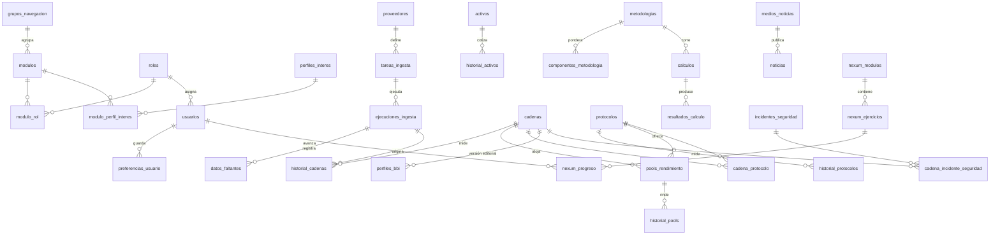
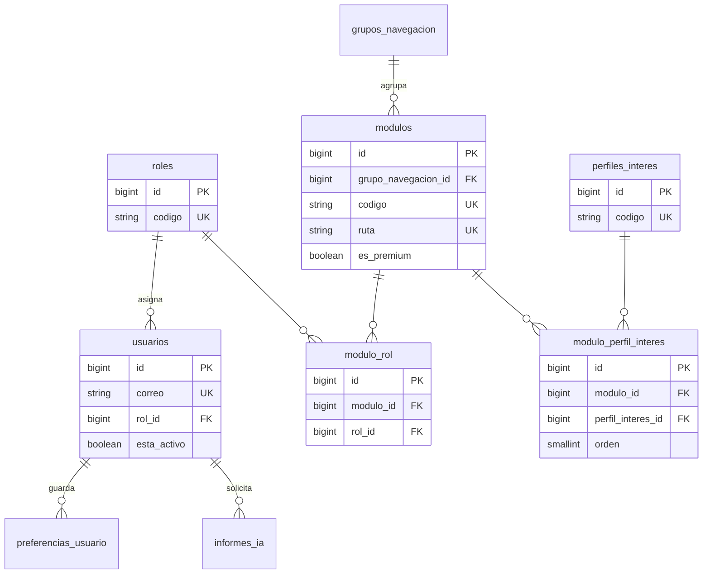
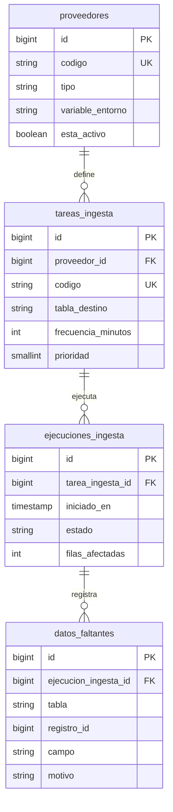
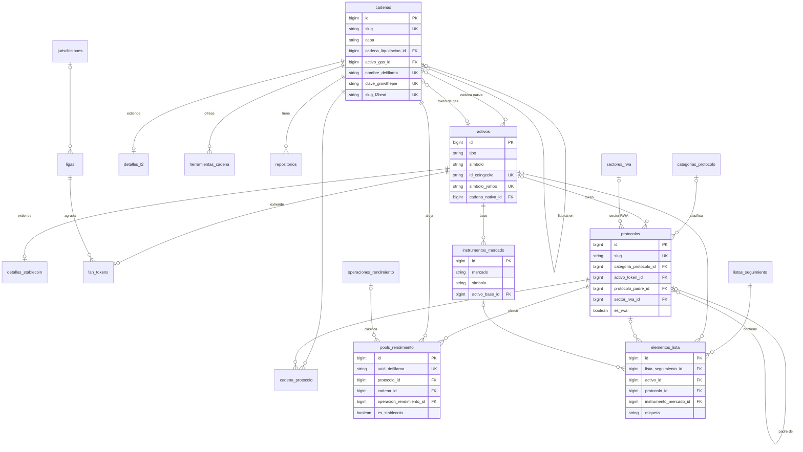
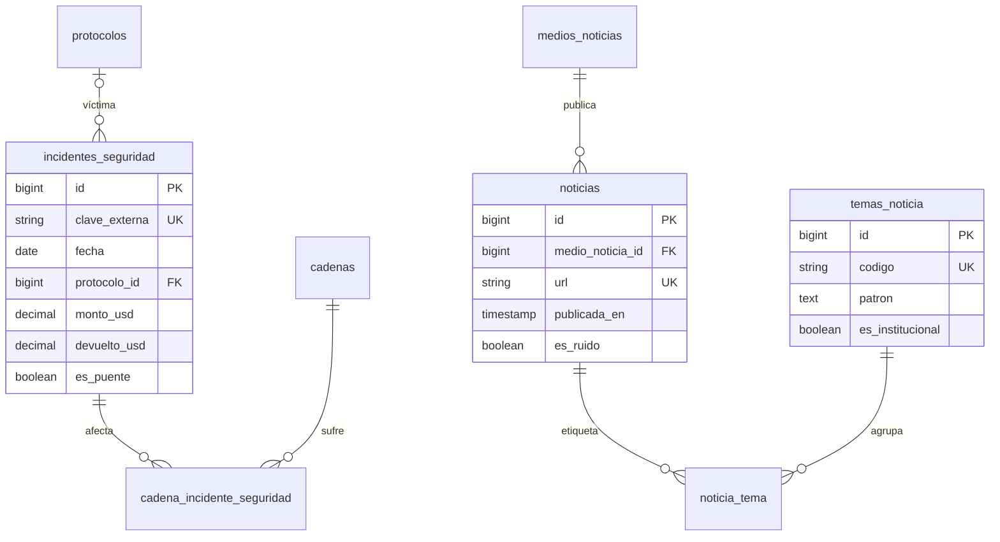
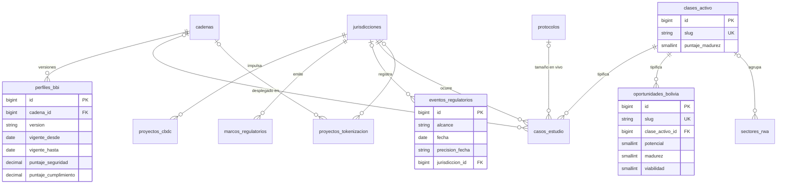
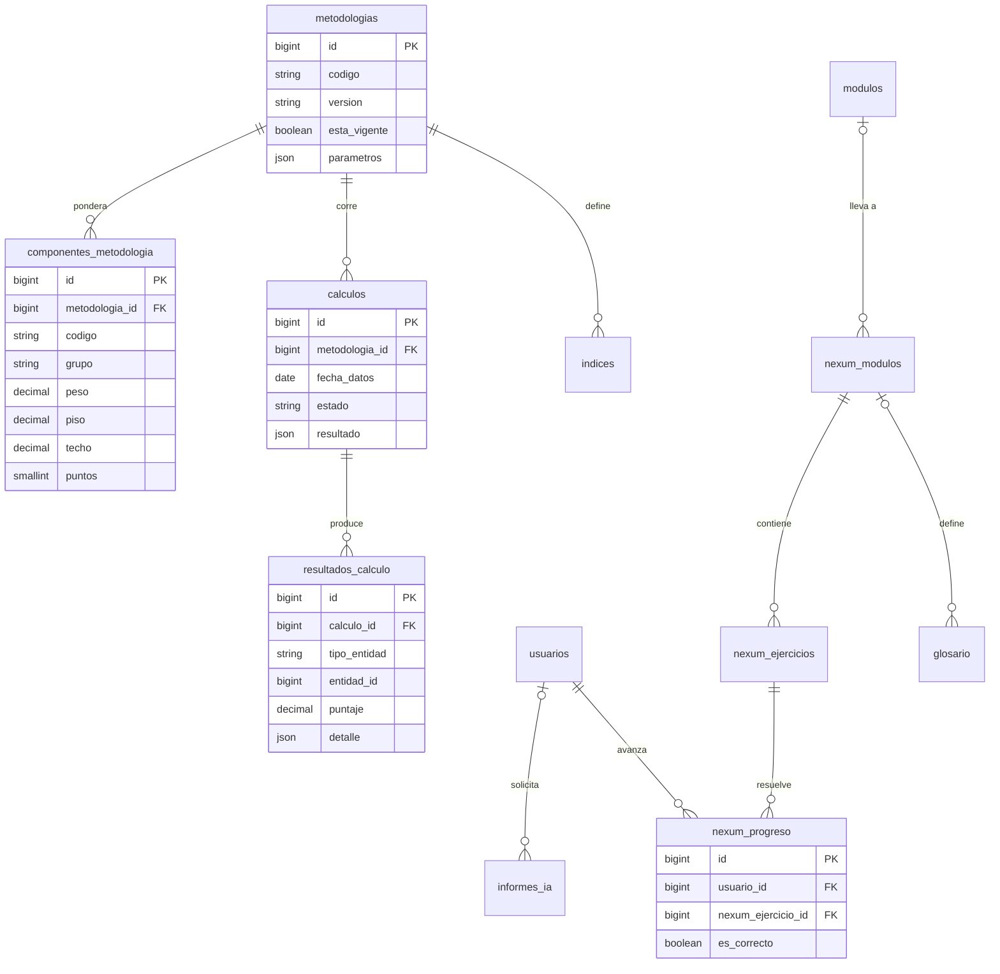

# BBIM — Modelo de datos para la migración a Laravel + Vue 3

> **Proyecto:** Blockfinity Blockchain Intelligence Monitor (BBIM / JaviviMonitor)
> **Objetivo:** pasar del prototipo Next.js "API en vivo + JSON + constantes en código" a una aplicación **Laravel (API + ingesta) + Vue 3 (SPA)** con base de datos propia.
> **Público:** programadores que implementen la migración y cualquier IA que vuelva a analizar el proyecto.
> **Fecha:** 28/09/2026 · **Versión del documento:** 1.0
> **Fuentes de este análisis:** el código del zip `JaviMonitor.zip` (172 archivos), el informe *Arquitectura de datos BBIM* (21/09/2026), el borrador `JaviviMonitor-modelo-ER.md` incluido en el zip y el documento previo `modelo-datos-bbim.md`.

---

## Índice

0. [Resumen en una página](#0-resumen-en-una-página)
1. [Contexto: qué hay hoy en el zip](#1-contexto-qué-hay-hoy-en-el-zip)
2. [Los cuatro principios y cómo se aplican](#2-los-cuatro-principios-y-cómo-se-aplican)
3. [Arquitectura objetivo Laravel + Vue 3](#3-arquitectura-objetivo-laravel--vue-3)
4. [Convenciones de nombres (regla única)](#4-convenciones-de-nombres-regla-única)
5. [Mapa de tablas por bloque](#5-mapa-de-tablas-por-bloque)
6. [Diccionario de tablas y atributos](#6-diccionario-de-tablas-y-atributos)
7. [Modelo ER (diagramas)](#7-modelo-er-diagramas)
8. [Modelo de llaves](#8-modelo-de-llaves)
9. [Justificación de cada decisión](#9-justificación-de-cada-decisión)
10. [De lo hardcodeado a la tabla](#10-de-lo-hardcodeado-a-la-tabla)
11. [Módulos del terminal → tablas → rutas API](#11-módulos-del-terminal--tablas--rutas-api)
12. [Ejemplos de implementación](#12-ejemplos-de-implementación)
13. [Plan por partes](#13-plan-por-partes)
14. [Riesgos detectados y pendientes](#14-riesgos-detectados-y-pendientes)

---

## 0. Resumen en una página

| Tema | Decisión |
|------|----------|
| Backend | Laravel 11/12 — API REST en `routes/api.php`, ingesta con comandos programados (Scheduler), cálculos como servicios |
| Frontend | Vue 3 (Composition API, `<script setup>`) + Vite + Vue Router. Sin Tailwind. CSS Modules importados desde el `<script>`, **nunca** bloques `<style>` |
| Base de datos | PostgreSQL 16 (compatible con MySQL 8: no se usan tipos exclusivos de Postgres) |
| Tamaño del modelo | **69 tablas en 8 bloques**, un solo esquema. El borrador anterior tenía ≈130 tablas en 12 esquemas |
| Llaves | Toda tabla tiene `id` autoincremental. Los ids de proveedores externos van como columnas `UNIQUE`. Las series usan `UNIQUE (entidad_id, fecha)` |
| Series | **Una fila por entidad por día** (`historial_*`), actualizada durante el día. Se acabó la duplicación "snapshot + diario" |
| Métricas | Tablas **anchas** (una columna por métrica conocida) en vez de una tabla larga clave-valor |
| Cálculos propios | Un par genérico `metodologias` + `componentes_metodologia` guarda pesos, anclas y reglas; `calculos` + `resultados_calculo` guarda BBI, Builder Score, riesgo de pools e índices |
| Permisos | Por **módulo** y **rol** (`modulo_rol`). Permisos por bloque o por fila quedan para una fase posterior |
| Idioma | Tablas, columnas, clases, componentes, variables y CSS en **español legible** |

---

## 1. Contexto: qué hay hoy en el zip

### 1.1 Inventario

| Carpeta | Contenido | Tamaño |
|---------|-----------|--------|
| `app/**/page.tsx` | 27 páginas (rutas del terminal) | ~3.000 líneas |
| `app/api/**/route.ts` | 41 rutas API que agregan fuentes externas | ~2.500 líneas |
| `lib/sources/*.ts` | 23 conectores a proveedores (DeFiLlama, CoinGecko, growthepie, L2BEAT, GitHub, Coin Metrics, Binance, Crypto.com, Yahoo, RSS…) | ~4.300 líneas |
| `lib/*.ts` | Cálculos propios: BBI, Builder Score, índices, yields, sectores RWA, hacks, Nexum, informe | ~4.500 líneas |
| `data/*.json` | 12 registros curados a mano | 170 KB |
| `tests/*.test.cjs` | 9 suites de pruebas (node:test) | ~1.070 líneas |
| `components/` | **No viene en el zip.** Las páginas importan 64 componentes (`@/components/...`) que no están | — |
| `app/globals.css` | Tema Tailwind 4 (`@theme`) + 339 usos de `className` solo en páginas | 1.529 líneas |

### 1.2 Cómo fluye el dato hoy

```
Proveedor externo ──► lib/sources/*.ts ──► lib/cache.ts (Map en memoria + copia en disco)
                                               │
                  data/*.json + constantes ────┼──► lib/*.ts (cálculos) ──► app/api/**/route.ts ──► React
```

- **No hay base de datos.** Lo que funciona como base es la caché: un `Map` en memoria con TTL y una copia en disco.
- **Todo se recalcula en cada petición.** El BBI, el Builder Score y el riesgo de los pools no se guardan: no se pueden auditar ni comparar entre fechas.
- **Lo editorial está en archivos JSON y en constantes.** Cambiar un peso del BBI, una categoría de noticias o la lista de ETFs obliga a editar código y volver a desplegar.

### 1.3 Qué significa "hardcodeado" en este proyecto

Hay tres tipos, y cada uno tiene un destino distinto en la base:

| Tipo | Ejemplos | Cuántos | Destino |
|------|----------|---------|---------|
| **Registros curados** (JSON) | `blockchains.json`, `cbdc-tracker.json`, `case-studies.json`, `nexum-curriculum.json` | 12 archivos | Tablas del bloque **Curado** |
| **Catálogos en código** | `NAV`, `INTERESTS`, `OPERATIONS`, `CATEGORIES` de noticias, `FEEDS` | ~15 constantes | Tablas del bloque **Catálogo** y **Acceso** |
| **Parámetros de metodología** | pesos BBI, `ACTIVITY_METRICS` (anclas), `PILLARS`, `PROFILES`, `COMPONENTS`, reglas de riesgo, `REGISTRY` de índices | ~10 constantes | `metodologias` + `componentes_metodologia` |
| **Listas de seguimiento** | `ETFS`, `EQUITIES`, `FOCUS`, `INSTRUMENTS`, `CORE_ASSETS`, `MACRO_SYMBOLS`, `TOP_ISSUERS`, `GESTORAS`, `CRYPTO_CDC`, `SLUGS` | ~12 constantes | `listas_seguimiento` + `elementos_lista` |

El detalle constante por constante está en la [sección 10](#10-de-lo-hardcodeado-a-la-tabla).

### 1.4 Relación con los documentos anteriores

| Documento | Qué aporta | Qué se cambia aquí |
|-----------|-----------|--------------------|
| `modelo-datos-bbim.md` (previo) | Separación ingesta / catálogo / hechos / curados / derivados; regla "nulo con motivo"; mapeo fuente → tabla | Nombres adaptados a Laravel, fusión de snapshot + diario, menos tablas |
| `JaviviMonitor-modelo-ER.md` (en el zip) | Catálogo de módulos, idea de asignar módulos a usuarios, inventario fino de campos por módulo | Se simplifica: 12 esquemas → 1, permisos polimórficos → `modulo_rol`, tablas por módulo → tablas por entidad, nombres en inglés → español |

---

## 2. Los cuatro principios y cómo se aplican

### P1 · KISS — simple y sin espagueti

| Regla concreta | Por qué |
|----------------|---------|
| Una tabla por **entidad** (cadena, protocolo, activo, pool), no una tabla por **pantalla** | Diez pantallas leen "TVL de una cadena". Si cada una tuviera su tabla, habría diez copias del mismo dato |
| Una sola tabla de historial por entidad | La pantalla "actual" es la fila de hoy; el gráfico es la serie completa. Se elimina la pareja snapshot/diario |
| Columnas explícitas antes que clave-valor | `historial_cadenas.tvl_usd` se entiende sin leer documentación; `observaciones(metrica_id=17)` no |
| `json` solo para listas que se muestran tal cual y **nunca** se filtran | Ej.: `habilitadores` de una oportunidad. Si algún día se filtra por eso, pasa a tabla |
| Un solo esquema de base de datos | Laravel trabaja cómodo con uno. Los bloques se ordenan en la documentación, no con esquemas |
| Sin procedimientos almacenados ni triggers | La lógica vive en PHP, donde se prueba y se versiona. La base solo guarda y garantiza integridad |
| Enumeraciones como `string` + `enum` de PHP | Agregar un valor es cambiar un archivo PHP, no una migración de tipo |
| Cada capa habla solo con la siguiente | Fuente → Servicio → Modelo → Controlador → Vue. Un componente Vue nunca llama a un proveedor externo |

### P2 · Español legible

Tablas, columnas, modelos, controladores, servicios, componentes Vue, variables JS/PHP y variables CSS se nombran en español completo. Se aceptan siglas del dominio que no tienen traducción natural: `tvl`, `apy`, `usd`, `dex`, `rwa`, `bbi`, `cbdc`, `etf`, `ath`, `l2`.

Las únicas palabras en inglés que quedan son las que **exige el framework** (ver 4.5).

### P3 · Camel_Snake_Case / UPPER_SNAKE_CASE para archivos y PascalCase para variables CSS

Ver la [sección 4](#4-convenciones-de-nombres-regla-única): cada tipo de archivo tiene una regla y un ejemplo.

### P4 · CSS modular, sin Tailwind y sin etiquetas `<style>`

- Cada componente Vue tiene **su** archivo `Nombre_Componente.module.css` en la misma carpeta y lo importa desde el `<script setup>`.
- Los estilos globales (variables del tema, reset, tipografía) viven en `resources/css/` y se encadenan con `@import` desde un único `Principal.css`.
- Las clases se usan como `:class="estilos.Tarjeta"`. Vite resuelve los CSS Modules de forma nativa: cada clase queda aislada al componente sin necesidad de `scoped`.
- Se elimina Tailwind: `tailwindcss` y `@tailwindcss/postcss` salen de las dependencias.

---

## 3. Arquitectura objetivo Laravel + Vue 3

### 3.1 Flujo

```
                  ┌────────────── Laravel ──────────────────────────────────────────┐
Scheduler ──► Comando_Ejecutar_Ingesta ──► Fuente_* (normaliza) ──► Modelos (upsert)│
                                                                       │            │
              Comando_Ejecutar_Calculos ──► Calculo_* ──► calculos / resultados     │
                                                                       │            │
Vue 3 ──HTTP──► routes/api.php ──► Controlador_* ──► Modelos (lectura) ─┘            │
                                   (Cache de Laravel + cabeceras Cache-Control)      │
                  └─────────────────────────────────────────────────────────────────┘
```

- **La base es la verdad.** Las rutas API ya no llaman a proveedores: leen tablas. El proveedor solo lo toca el comando de ingesta.
- **La caché de Laravel** (`Cache::remember`, driver `file` o `redis`) guarda la respuesta JSON armada, con el mismo TTL que hoy declara `lib/httpCache.ts`.
- **El precalentado desaparece como concepto:** el Scheduler ingiere antes de que alguien pida el dato. `lib/warmup.ts` e `instrumentation.ts` se reemplazan por `routes/console.php`.

### 3.2 Estructura de carpetas

Las carpetas que crea Laravel conservan su nombre (cualquier programador Laravel las encuentra). Las carpetas **propias** van en español.

```
bbim/
├── app/
│   ├── Console/Commands/
│   │   ├── Comando_Ejecutar_Ingesta.php        # bbim:ingestar {tarea?}
│   │   └── Comando_Ejecutar_Calculos.php       # bbim:calcular {metodologia?}
│   ├── Enumeraciones/                          # enums de PHP (propia)
│   │   ├── Estado_Ingesta.php
│   │   ├── Motivo_Faltante.php
│   │   └── Tipo_Activo.php
│   ├── Http/Controllers/Api/
│   │   ├── Controlador_Cadenas.php
│   │   ├── Controlador_Protocolos.php
│   │   └── Controlador_Rendimientos.php
│   ├── Models/
│   │   ├── Modelo_Base.php                     # timestamps en español
│   │   ├── Cadena.php
│   │   ├── Historial_Cadena.php
│   │   └── Pool_Rendimiento.php
│   └── Servicios/                              # propia
│       ├── Fuentes/
│       │   ├── Fuente_Base.php                 # registra ejecución y faltantes
│       │   ├── Fuente_Defi_Llama.php
│       │   ├── Fuente_Coin_Gecko.php
│       │   └── Fuente_Growthepie.php
│       └── Calculos/
│           ├── Calculo_Bbi.php
│           ├── Calculo_Radar_Constructor.php
│           └── Calculo_Riesgo_Pools.php
├── database/
│   ├── migrations/
│   │   └── 2026_10_01_000100_Crear_Tabla_Cadenas.php
│   ├── seeders/
│   │   ├── DatabaseSeeder.php                  # nombre exigido por Laravel
│   │   ├── Sembrador_Navegacion.php
│   │   └── Sembrador_Cadenas.php
│   └── Datos_Iniciales/                        # los 12 JSON actuales, solo para sembrar
├── resources/
│   ├── css/
│   │   ├── Principal.css                       # solo @import
│   │   └── Base/
│   │       ├── Variables_Tema.css
│   │       ├── Reinicio.css
│   │       ├── Tipografia.css
│   │       └── Disposicion.css
│   └── js/
│       ├── Principal.js                        # createApp + router + import del CSS
│       ├── Enrutador.js
│       ├── Composables/
│       │   ├── Usar_Fuente.js                  # reemplaza lib/useSource.ts
│       │   └── Usar_Formato.js                 # reemplaza lib/format.ts
│       ├── Componentes/
│       │   ├── Comunes/
│       │   │   ├── Encabezado_Pagina.vue
│       │   │   └── Encabezado_Pagina.module.css
│       │   └── Defi/
│       │       ├── Tarjeta_Top_Protocolos.vue
│       │       └── Tarjeta_Top_Protocolos.module.css
│       └── Paginas/
│           ├── Pagina_Portada.vue
│           └── Pagina_Defi.vue
└── routes/
    ├── api.php
    └── console.php                             # programación de la ingesta
```

---

## 4. Convenciones de nombres (regla única)

### 4.1 Base de datos

| Elemento | Regla | Ejemplo |
|----------|-------|---------|
| Tabla de entidad | `snake_case`, **plural**, minúsculas | `cadenas`, `pools_rendimiento`, `incidentes_seguridad` |
| Tabla de historial | `historial_` + entidad en plural | `historial_cadenas`, `historial_pools` |
| Tabla pivote (N:M) | los dos nombres en **singular**, orden alfabético (convención Laravel) | `cadena_protocolo`, `modulo_rol` |
| Columna | `snake_case` minúsculas | `tvl_usd`, `cambio_7d_pct`, `fecha_corte` |
| Llave primaria | siempre `id` | `id` |
| Llave foránea | tabla en singular + `_id` | `cadena_id`, `protocolo_id` |
| Autorrelación | rol + `_id` | `cadena_liquidacion_id` |
| Booleano | prefijo `es_`, `tiene_`, `esta_` | `es_rwa`, `es_stablecoin`, `esta_activo` |
| Fecha | `fecha` (date) · `fecha_hora` (timestamp) · sufijo `_en` para eventos | `publicada_en`, `ejecutado_en` |
| Porcentaje | sufijo `_pct` | `cambio_24h_pct` |
| Puntos porcentuales | sufijo `_pp` (cambios de APY) | `cambio_7d_pp` |
| Dinero | sufijo `_usd` o `_bob` | `ingresos_30d_usd` |
| Auditoría | `creado_en`, `actualizado_en`, `eliminado_en` | — |

> **Por qué minúsculas en la base:** PostgreSQL convierte a minúsculas todo identificador sin comillas y MySQL distingue mayúsculas según el sistema operativo. `snake_case` en minúsculas es la única forma portable y la que usa Eloquent.

### 4.2 Archivos del backend (Camel_Snake_Case)

Cada palabra empieza en mayúscula y se separa con guion bajo. En PHP el nombre de la clase es igual al del archivo (PSR-4), así que la clase también lleva ese formato.

| Tipo | Patrón | Ejemplo |
|------|--------|---------|
| Modelo | entidad en singular | `Cadena.php`, `Historial_Cadena.php`, `Pool_Rendimiento.php` |
| Controlador | `Controlador_` + recurso en plural | `Controlador_Protocolos.php` |
| Servicio de fuente | `Fuente_` + proveedor | `Fuente_Defi_Llama.php` |
| Servicio de cálculo | `Calculo_` + metodología | `Calculo_Bbi.php` |
| Comando | `Comando_` + acción | `Comando_Ejecutar_Ingesta.php` |
| Enum | concepto | `Estado_Ingesta.php` |
| Migración | `AAAA_MM_DD_HHMMSS_` + acción | `2026_10_01_000100_Crear_Tabla_Cadenas.php` |
| Sembrador | `Sembrador_` + tabla | `Sembrador_Cadenas.php` |
| Prueba | `Prueba_` + unidad | `tests/Unit/Prueba_Calculo_Bbi.php` |

### 4.3 Archivos del frontend

| Tipo | Patrón | Ejemplo |
|------|--------|---------|
| Página | `Pagina_` + módulo | `Pagina_Defi.vue` |
| Componente | tipo + contenido | `Tarjeta_Top_Protocolos.vue`, `Grafico_Tvl_Historico.vue`, `Tabla_Datos.vue` |
| Estilo del componente | mismo nombre + `.module.css` | `Tarjeta_Top_Protocolos.module.css` |
| Composable | `Usar_` + qué | `Usar_Fuente.js` → exporta `usarFuente()` |
| Estilo global | concepto | `Variables_Tema.css`, `Tipografia.css` |
| Constantes (si quedan) | UPPER_SNAKE_CASE | `RUTAS_API.js` |

Prefijos de componente sugeridos: `Tarjeta_`, `Tabla_`, `Grafico_`, `Panel_`, `Mapa_`, `Lista_`, `Formulario_`, `Boton_`, `Ficha_`.

### 4.4 Código

| Elemento | Regla | Ejemplo |
|----------|-------|---------|
| Variable JS / PHP | camelCase en español | `tvlTotal`, `$listaProtocolos` |
| Función / método | verbo en camelCase | `obtenerProtocolos()`, `calcularPuntaje()` |
| Constante JS / PHP | UPPER_SNAKE_CASE | `TTL_POR_DEFECTO` |
| **Variable CSS** | **PascalCase** con prefijo de tipo | `--ColorFondo`, `--EspacioMedio`, `--FuenteMono` |
| Clase CSS (en CSS Modules) | PascalCase | `.Tarjeta`, `.TarjetaTitulo` → `estilos.TarjetaTitulo` |

> Las clases en PascalCase se leen desde JS como `estilos.TarjetaTitulo` sin corchetes; con guiones habría que escribir `estilos['tarjeta-titulo']`.

### 4.5 Excepciones impuestas por el framework

No se renombran porque Laravel, Vite o npm las buscan por nombre exacto: `composer.json`, `package.json`, `vite.config.js`, `artisan`, `config/*.php`, `routes/api.php`, `routes/console.php`, `DatabaseSeeder.php`, carpetas `app/Models`, `app/Http/Controllers`, `database/migrations`. La tabla `sessions`, `jobs`, `cache` y `failed_jobs` de Laravel también se dejan con su nombre.

---

## 5. Mapa de tablas por bloque

| Bloque | Para qué | Tablas | Quién escribe | Crece |
|--------|----------|:------:|---------------|-------|
| **A · Acceso y navegación** | Usuarios, roles, módulos del menú, perfiles de interés | 8 | Administrador | Poco |
| **B · Ingesta** | Qué se descarga, cuándo, con qué resultado | 4 | Sistema | Medio |
| **C · Catálogo** | Entidades estables: cadenas, activos, protocolos, pools, instrumentos | 17 | Ingesta + editor | Medio |
| **D · Historial** | Series diarias (y una horaria) de cada entidad | 12 | Ingesta | **Alto** |
| **E · Eventos** | Hacks y noticias | 6 | Ingesta | Medio |
| **F · Curado** | Lo que hoy está en `data/*.json` | 11 | Editor | Poco |
| **G · Metodología y cálculos** | Pesos, reglas, índices y resultados versionados | 6 | Analista + sistema | Medio |
| **H · Nexum** | Capa educativa y progreso del estudiante | 5 | Editor + usuario | Poco |
| **Total** | | **69** | | |

```
A  usuarios · roles · grupos_navegacion · modulos · perfiles_interes · modulo_perfil_interes · modulo_rol · preferencias_usuario
B  proveedores · tareas_ingesta · ejecuciones_ingesta · datos_faltantes
C  cadenas · detalles_l2 · herramientas_cadena · repositorios · activos · detalles_stablecoin · ligas · fan_tokens
   categorias_protocolo · protocolos · cadena_protocolo · operaciones_rendimiento · pools_rendimiento
   instrumentos_mercado · listas_seguimiento · elementos_lista · jurisdicciones
D  historial_mercado_global · historial_cadenas · historial_protocolos · estados_resultados · historial_activos
   historial_velas · historial_derivados · historial_onchain · historial_stablecoins_cadena · historial_pools
   historial_repositorios · historial_rwa
E  incidentes_seguridad · cadena_incidente_seguridad · medios_noticias · temas_noticia · noticias · noticia_tema
F  perfiles_bbi · clases_activo · sectores_rwa · casos_estudio · proyectos_tokenizacion · oportunidades_bolivia
   proyectos_cbdc · marcos_regulatorios · eventos_regulatorios · alianzas · indicadores_editoriales
G  metodologias · componentes_metodologia · indices · calculos · resultados_calculo · informes_ia
H  nexum_niveles · nexum_modulos · nexum_ejercicios · glosario · nexum_progreso
```

---

## 6. Diccionario de tablas y atributos

**Leyenda de tipos** (nombres de la migración de Laravel): `id` = bigint autoincremental · `fk` = `foreignId` (bigint) · `str(n)` = `string` · `dec(p,s)` = `decimal` · `bool` = `boolean` · `json` · `text` · `date` · `ts` = `timestamp` · `int` · `sint` = `smallInteger`.
**Llave:** PK primaria · FK foránea · UK única · IX índice.
**Dinero:** `dec(24,2)` · **Precios:** `dec(24,8)` · **Porcentajes:** `dec(12,4)` · **Cantidades de tokens:** `dec(38,8)`.

### Columnas comunes (se declaran una vez, no se repiten en cada tabla)

| Grupo | Columnas | Dónde |
|-------|----------|-------|
| **Auditoría** | `creado_en ts`, `actualizado_en ts` | Todas las tablas de A, C, F, G, H |
| **Borrado lógico** | `eliminado_en ts null` | A (usuarios), F (todo el bloque Curado) |
| **Fuente editorial** | `nombre_fuente str(200) null`, `url_fuente str(500) null`, `fecha_corte date null`, `verificado_en date null` | Todo el bloque F |
| **Trazabilidad** | `ejecucion_ingesta_id fk null → ejecuciones_ingesta` | Todo el bloque D y `incidentes_seguridad`, `noticias` |

> Las tablas de historial **no** llevan `creado_en`/`actualizado_en`: el momento real de la lectura está en `ejecuciones_ingesta.iniciado_en`.

---

### A · Acceso y navegación

#### `usuarios`
| Columna | Tipo | Nulo | Llave | Descripción |
|---------|------|:----:|:-----:|-------------|
| id | id | | PK | |
| nombre | str(120) | | | Nombre visible |
| correo | str(160) | | UK | Usuario de inicio de sesión |
| contrasena | str(255) | | | Hash bcrypt/argon. Se declara en el modelo con `$authPasswordName = 'contrasena'` |
| rol_id | fk | | FK → roles | Un rol por usuario (KISS) |
| esta_activo | bool | | | `true` por defecto |
| ultimo_acceso_en | ts | sí | | |
| remember_token | str(100) | sí | | Nombre exigido por Laravel |

#### `roles`
| Columna | Tipo | Nulo | Llave | Descripción |
|---------|------|:----:|:-----:|-------------|
| id | id | | PK | |
| codigo | str(40) | | UK | `administrador`, `editor`, `analista`, `cliente`, `instructor`, `estudiante`, `invitado` |
| nombre | str(80) | | | |
| descripcion | text | sí | | |

> El `instructorPin: "3141"` de `nexum-curriculum.json` desaparece: ser instructor es tener el rol `instructor`.

#### `grupos_navegacion`
| Columna | Tipo | Nulo | Llave | Descripción |
|---------|------|:----:|:-----:|-------------|
| id | id | | PK | |
| titulo | str(80) | | UK | Los 8 grupos de `lib/nav.ts`: *Executive Brief*, *Institutional Intelligence*… |
| orden | sint | | | |

#### `modulos`
| Columna | Tipo | Nulo | Llave | Descripción |
|---------|------|:----:|:-----:|-------------|
| id | id | | PK | |
| grupo_navegacion_id | fk | | FK | |
| codigo | str(3) | | UK | Código del riel contraído: `HOY`, `DFI`, `BBI`, `NXM`… (27) |
| nombre | str(80) | | | "Protocol Analytics" |
| ruta | str(120) | | UK | `/defi`, `/defi/yields` (se conservan las URL actuales) |
| orden | sint | | | |
| es_premium | bool | | | Atajo para planes: fuera del rol `cliente` básico |
| esta_activo | bool | | | |

#### `perfiles_interes`
| Columna | Tipo | Nulo | Llave | Descripción |
|---------|------|:----:|:-----:|-------------|
| id | id | | PK | |
| codigo | str(20) | | UK | `inversion`, `riesgo`, `cumplimiento`, `tecnologia`, `institucional`, `formacion` |
| nombre | str(80) | | | "Inversión y mercado" |
| nombre_corto | str(30) | | | "Inversión" |
| audiencia | str(200) | | | A quién le sirve |
| pregunta | str(200) | | | Qué pregunta responde |
| unidad_negocio | str(80) | | | "Compliance Solutions", "NEXUM"… |

#### `modulo_perfil_interes` (pivote N:M)
| Columna | Tipo | Nulo | Llave | Descripción |
|---------|------|:----:|:-----:|-------------|
| id | id | | PK | |
| modulo_id | fk | | FK, UK(1) | |
| perfil_interes_id | fk | | FK, UK(1) | |
| orden | sint | | | `1` = perfil principal (hoy es el primero del arreglo `interests`) |

#### `modulo_rol` (pivote N:M)
| Columna | Tipo | Nulo | Llave | Descripción |
|---------|------|:----:|:-----:|-------------|
| id | id | | PK | |
| modulo_id | fk | | FK, UK(1) | |
| rol_id | fk | | FK, UK(1) | Si existe la fila, el rol ve el módulo |

#### `preferencias_usuario`
| Columna | Tipo | Nulo | Llave | Descripción |
|---------|------|:----:|:-----:|-------------|
| id | id | | PK | |
| usuario_id | fk | | FK, UK(1) | |
| clave | str(60) | | UK(1) | `riel_contraido`, `perfiles_seleccionados` (hoy en `localStorage`, ver `lib/prefStore.ts`) |
| valor | json | | | |

---

### B · Ingesta

#### `proveedores`
| Columna | Tipo | Nulo | Llave | Descripción |
|---------|------|:----:|:-----:|-------------|
| id | id | | PK | |
| codigo | str(40) | | UK | `defillama`, `coingecko`, `growthepie`, `l2beat`, `github`, `coinmetrics`, `binance`, `bybit`, `cryptocom`, `yahoo`, `blockscout`, `alternative_me`, `messari`, `dune`, `nansen`, `anthropic`, `bcb`, `lector_jina`, `rss` |
| nombre | str(80) | | | |
| tipo | str(20) | | | `api`, `scraping`, `rss`, `websocket`, `ia` |
| url_base | str(300) | sí | | |
| requiere_clave | bool | | | |
| variable_entorno | str(60) | sí | | Nombre de la variable en `.env`, nunca el valor |
| limite_por_hora | int | sí | | GitHub sin token: 60 |
| esta_activo | bool | | | Nansen y BCB hoy: `false` |

#### `tareas_ingesta`
Una fila por endpoint que se descarga. Reemplaza los TTL dispersos en `lib/sources/*.ts` y la lista `TASKS` de `lib/warmup.ts`.

| Columna | Tipo | Nulo | Llave | Descripción |
|---------|------|:----:|:-----:|-------------|
| id | id | | PK | |
| proveedor_id | fk | | FK | |
| codigo | str(80) | | UK | Igual a la clave de caché actual: `defillama:protocols`, `defillama:yields:universe:v1` |
| descripcion | str(200) | | | |
| ruta_origen | str(300) | | | `/protocols`, `/v2/historicalChainTvl/{cadena}` |
| tabla_destino | str(60) | | | Tabla principal que alimenta |
| frecuencia_minutos | int | | | 30, 60, 360, 720… (el TTL de hoy) |
| frecuencia_parcial_minutos | int | sí | | Reintento si la tanda vino incompleta (GitHub: 30) |
| parametros | json | sí | | `{"dias": 400}` |
| prioridad | sint | | | Orden de ejecución (las descargas grandes primero, en serie) |
| esta_activa | bool | | | |

#### `ejecuciones_ingesta`
| Columna | Tipo | Nulo | Llave | Descripción |
|---------|------|:----:|:-----:|-------------|
| id | id | | PK | |
| tarea_ingesta_id | fk | | FK, IX(1) | |
| iniciado_en | ts | | IX(1) | |
| finalizado_en | ts | sí | | |
| estado | str(12) | | | `en_curso`, `correcto`, `parcial`, `error`, `omitido` |
| codigo_http | sint | sí | | |
| bytes | int | sí | | |
| filas_afectadas | int | sí | | |
| mensaje_error | text | sí | | |

#### `datos_faltantes`
Aplica la regla que hoy vive en `lib/networks/types.ts`: *un dato que la fuente no publica es `null`, nunca `0`, y viaja con su motivo*.

| Columna | Tipo | Nulo | Llave | Descripción |
|---------|------|:----:|:-----:|-------------|
| id | id | | PK | |
| ejecucion_ingesta_id | fk | | FK | |
| tabla | str(60) | | IX(1) | `historial_pools` |
| registro_id | bigint | | IX(1) | id de la fila afectada |
| campo | str(60) | | | `apy_recompensa_pct` |
| motivo | str(20) | | | `no_publicado`, `fuente_caida`, `sin_clave`, `fuera_de_rango`, `no_aplica` |
| detalle | str(300) | sí | | |

---

### C · Catálogo

#### `cadenas`
Une lo que hoy está repartido entre `networks.json` (ficha técnica de 15 redes), `blockchains.json` (21 redes del BBI) y las cadenas que devuelve DeFiLlama.

| Columna | Tipo | Nulo | Llave | Descripción |
|---------|------|:----:|:-----:|-------------|
| id | id | | PK | |
| slug | str(60) | | UK | `ethereum`, `arbitrum`, `tron` |
| nombre | str(80) | | | |
| capa | str(5) | | | `L1`, `L2`, `otra` |
| tipo_descripcion | str(80) | sí | | "L1 · PoS", "L2 · Optimistic" |
| familia_vm | str(20) | sí | | `EVM`, `zkEVM`, `SVM`, `Move VM`, `WASM`, `TVM` |
| lenguaje | str(80) | sí | | "Solidity · Vyper" |
| cadena_liquidacion_id | fk | sí | FK → cadenas | Dónde liquida una L2 (`settlesOn`) |
| activo_gas_id | fk | sí | FK → activos | Token de gas (`gasToken`) |
| anio_lanzamiento | sint | sí | | |
| tiempo_bloque_seg | dec(10,3) | sí | | |
| finalidad_seg | int | sí | | |
| nota_finalidad | text | sí | | |
| modelo_comisiones | text | sí | | |
| abstraccion_cuentas | str(80) | sí | | "ERC-4337 + EIP-7702" |
| url_documentacion · url_faucet · url_grants | str(300) | sí | | |
| nombre_defillama | str(80) | sí | UK | `keys.llama` / `llamaName` |
| clave_growthepie | str(60) | sí | UK | `keys.growthepie` |
| slug_l2beat | str(60) | sí | UK | `keys.l2beat` |
| esta_en_radar | bool | | | Las 15 del Builder Radar |
| esta_en_bbi | bool | | | Las 21 del BBI |
| esta_activa | bool | | | |

#### `detalles_l2` (1:1 con `cadenas`, datos de L2BEAT)
| Columna | Tipo | Nulo | Llave | Descripción |
|---------|------|:----:|:-----:|-------------|
| id | id | | PK | |
| cadena_id | fk | | FK, UK | |
| categoria | str(40) | sí | | "Optimistic Rollup", "ZK Rollup", "Validium" |
| etapa | str(20) | sí | | "Stage 0/1/2" |
| disponibilidad_datos | str(80) | sí | | |
| maquina_virtual | str(40) | sí | | |
| proveedores | json | sí | | `["OP Stack"]` |
| riesgos | json | sí | | Lista `{nombre, valor, sentimiento, descripcion}` — se muestra tal cual |
| esta_en_revision | bool | | | |

#### `herramientas_cadena`
Reemplaza el objeto `tooling` de `networks.json`.

| Columna | Tipo | Nulo | Llave | Descripción |
|---------|------|:----:|:-----:|-------------|
| id | id | | PK | |
| cadena_id | fk | | FK, UK(1) | |
| tipo | str(20) | | UK(1) | `framework` (Foundry, Hardhat, Remix), `oraculo`, `indexador`, `billetera`, `sdk` |
| nombre | str(80) | | UK(1) | "Chainlink", "The Graph", "MetaMask" |

#### `repositorios`
| Columna | Tipo | Nulo | Llave | Descripción |
|---------|------|:----:|:-----:|-------------|
| id | id | | PK | |
| cadena_id | fk | | FK | |
| propietario | str(80) | | UK(1) | `ethereum` |
| nombre | str(80) | | UK(1) | `go-ethereum` |
| nota | text | sí | | `repoNote` |

#### `activos`
Un solo catálogo para cripto, stablecoins, fan tokens y lo tradicional que hoy sale de Yahoo (ETF, acciones, índices).

| Columna | Tipo | Nulo | Llave | Descripción |
|---------|------|:----:|:-----:|-------------|
| id | id | | PK | |
| tipo | str(20) | | IX | `cripto`, `stablecoin`, `fan_token`, `etf`, `accion`, `indice`, `materia_prima`, `divisa`, `tasa` |
| simbolo | str(20) | | | `BTC`, `USDC`, `IBIT`, `^GSPC` |
| nombre | str(120) | | | |
| id_coingecko | str(80) | sí | UK | |
| simbolo_yahoo | str(20) | sí | UK | `^GSPC`, `GC=F`, `IBIT` |
| slug_messari | str(60) | sí | | |
| cadena_nativa_id | fk | sí | FK → cadenas | |
| suministro_maximo | dec(38,8) | sí | | |
| url_imagen | str(300) | sí | | |
| esta_activo | bool | | | |

#### `detalles_stablecoin` (1:1 con `activos`)
| Columna | Tipo | Nulo | Llave | Descripción |
|---------|------|:----:|:-----:|-------------|
| id | id | | PK | |
| activo_id | fk | | FK, UK | |
| id_defillama | int | | UK | Id numérico de DeFiLlama Stablecoins |
| mecanismo_anclaje | str(20) | | | `fiat`, `cripto`, `algoritmico`, `materia_prima` |
| moneda_ancla | str(8) | | | `USD`, `EUR` |
| emisor | str(120) | sí | | |

#### `ligas` y `fan_tokens`
Reemplazan `leagueMap` de `fan-tokens.json`.

| Tabla | Columna | Tipo | Nulo | Llave | Descripción |
|-------|---------|------|:----:|:-----:|-------------|
| ligas | id | id | | PK | |
| ligas | nombre | str(80) | | UK | "Serie A (Italia)", "Fórmula 1" |
| ligas | deporte | str(40) | sí | | |
| ligas | jurisdiccion_id | fk | sí | FK | |
| ligas | orden | sint | | | |
| fan_tokens | id | id | | PK | |
| fan_tokens | activo_id | fk | | FK, UK | |
| fan_tokens | liga_id | fk | | FK | |
| fan_tokens | club | str(80) | sí | | |

#### `categorias_protocolo`
`id` PK · `nombre str(60)` UK (Lending, DEX, RWA, RWA Lending, CDP, Liquid Staking…).

#### `protocolos`
| Columna | Tipo | Nulo | Llave | Descripción |
|---------|------|:----:|:-----:|-------------|
| id | id | | PK | |
| slug | str(100) | | UK | Slug de DeFiLlama |
| nombre | str(120) | | | |
| categoria_protocolo_id | fk | sí | FK | |
| activo_token_id | fk | sí | FK → activos | |
| protocolo_padre_id | fk | sí | FK → protocolos | Aave → Aave V3 |
| sector_rwa_id | fk | sí | FK → sectores_rwa | Clasificación propia (`sectorMap`); cada protocolo en un solo sector |
| url | str(300) | sí | | |
| es_rwa | bool | | IX | Categoría `RWA` o `RWA Lending` |
| esta_activo | bool | | | Deja de aparecer en `/protocols` → `false` |

#### `cadena_protocolo` (pivote N:M)
`id` PK · `cadena_id` FK · `protocolo_id` FK · UK(`cadena_id`, `protocolo_id`).

#### `operaciones_rendimiento`
Reemplaza `OPERATIONS` de `lib/yields.ts`.

| Columna | Tipo | Nulo | Llave | Descripción |
|---------|------|:----:|:-----:|-------------|
| id | id | | PK | |
| codigo | str(20) | | UK | `prestamo`, `staking`, `restaking`, `dolares`, `rwa`, `liquidez`, `tasa_fija`, `boveda`, `otra` |
| nombre | str(60) | | | |
| descripcion | text | | | |
| orden | sint | | | |

#### `pools_rendimiento`
| Columna | Tipo | Nulo | Llave | Descripción |
|---------|------|:----:|:-----:|-------------|
| id | id | | PK | |
| uuid_defillama | str(36) | | UK | |
| protocolo_id | fk | | FK, IX | |
| cadena_id | fk | | FK, IX | |
| operacion_rendimiento_id | fk | sí | FK | La clasifica `Calculo_Riesgo_Pools` |
| simbolo | str(120) | | | `USDC-WETH` |
| categoria | str(60) | sí | | "Uncollateralized Lending"… |
| es_stablecoin | bool | | | |
| tiene_perdida_impermanente | bool | | | |
| exposicion | str(10) | sí | | `simple`, `multiple` |
| tokens_recompensa | json | sí | | |
| plazo_tipo | str(12) | sí | | `vencimiento`, `salida`, `bloqueo` |
| plazo_dias | int | sí | | |
| fecha_vencimiento | date | sí | | |
| visto_primero_en · visto_ultimo_en | date | | | |
| esta_activo | bool | | | |

> **Umbral de guardado:** solo se guardan los pools con TVL ≥ 100.000 USD o que ya estén en la tabla. `/pools` trae ~20.000 filas (11,3 MB); guardarlas todas es repetir el problema 4 del informe de arquitectura.

#### `instrumentos_mercado`
| Columna | Tipo | Nulo | Llave | Descripción |
|---------|------|:----:|:-----:|-------------|
| id | id | | PK | |
| mercado | str(20) | | UK(1) | `cryptocom`, `binance_futuros`, `bybit` |
| simbolo | str(30) | | UK(1) | `BTC_USDT`, `BTCUSDT` |
| activo_base_id | fk | | FK → activos | |
| moneda_cotizacion | str(10) | | | `USDT` |
| tipo | str(10) | | | `spot`, `perpetuo` |

#### `listas_seguimiento` y `elementos_lista`
Reemplazan una docena de arreglos fijos en el código (ver [sección 10](#10-de-lo-hardcodeado-a-la-tabla)).

| Tabla | Columna | Tipo | Nulo | Llave | Descripción |
|-------|---------|------|:----:|:-----:|-------------|
| listas_seguimiento | id | id | | PK | |
| listas_seguimiento | codigo | str(40) | | UK | `etfs_cripto`, `acciones_cripto`, `stablecoins_foco`, `instrumentos_portada`, `activos_nucleo`, `macro`, `emisores_stablecoin`, `gestoras_rwa`, `correlaciones`, `entidades_noticias` |
| listas_seguimiento | nombre | str(80) | | | |
| listas_seguimiento | descripcion | text | sí | | Para qué pantalla sirve |
| elementos_lista | id | id | | PK | |
| elementos_lista | lista_seguimiento_id | fk | | FK, IX | |
| elementos_lista | activo_id | fk | sí | FK | Máximo **una** de las tres FK con valor |
| elementos_lista | protocolo_id | fk | sí | FK | |
| elementos_lista | instrumento_mercado_id | fk | sí | FK | |
| elementos_lista | etiqueta | str(120) | sí | | Obligatoria si no hay FK (ej. "JPMorgan" en `entidades_noticias`) |
| elementos_lista | nota | str(200) | sí | | Ej. gestora y plataforma en `gestoras_rwa` |
| elementos_lista | orden | sint | | | |

#### `jurisdicciones`
Cubre países y uniones (la Unión Europea y la Zona euro aparecen en el tracker CBDC y no son países).

| Columna | Tipo | Nulo | Llave | Descripción |
|---------|------|:----:|:-----:|-------------|
| id | id | | PK | |
| codigo | str(4) | | UK | ISO 3166-1 alfa-2 (`BO`, `BS`) o `EU` |
| nombre | str(80) | | | |
| tipo | str(10) | | | `pais`, `union` |
| region | str(40) | sí | | |
| banco_central | str(120) | sí | | |
| latitud · longitud | dec(9,6) | sí | | Punto del mapa CBDC |

---

### D · Historial

**Regla de todo el bloque:** una fila por entidad y por día. Durante el día la ingesta hace `upsert` sobre la misma fila; el valor "actual" que muestra el terminal es la fila más reciente. Todas llevan `id` PK, la FK de su entidad, `fecha date`, `ejecucion_ingesta_id` y una **UK (entidad_id, fecha)** que es a la vez la regla de unicidad y el índice de lectura. Las columnas numéricas son todas **nulables** (nulo con motivo).

#### `historial_mercado_global` — UK(`fecha`)
Una fila por día con las cifras que no pertenecen a una entidad.

| Columna | Tipo | Fuente |
|---------|------|--------|
| tvl_defi_usd | dec(24,2) | DeFiLlama `/v2/historicalChainTvl` |
| capitalizacion_cripto_usd · volumen_cripto_24h_usd | dec(24,2) | CoinGecko `/global` |
| cambio_capitalizacion_24h_pct | dec(12,4) | CoinGecko |
| dominancia_btc_pct · dominancia_eth_pct | dec(12,4) | CoinGecko |
| stablecoins_total_usd | dec(24,2) | Dashboard de stablecoins |
| stablecoins_cambio_1d_pct · _7d_pct · _30d_pct | dec(12,4) | Dashboard de stablecoins |
| stablecoin_dominante_id | fk → activos | Dashboard de stablecoins |
| dominancia_stablecoin_pct | dec(12,4) | Dashboard de stablecoins |
| volumen_dex_24h_usd · volumen_dex_cambio_7d_pct | dec | DeFiLlama `/overview/dexs` |
| miedo_codicia_valor | sint | Alternative.me (0–100) |
| miedo_codicia_clasificacion | str(30) | Alternative.me |
| tipo_cambio_oficial_bob | dec(12,4) | BCB (hoy desconectado) |

#### `historial_cadenas` — UK(`cadena_id`, `fecha`)
| Columna | Tipo | Fuente |
|---------|------|--------|
| tvl_usd · tvl_cambio_1d_pct | dec | DeFiLlama `/v2/chains` e histórico |
| stablecoins_usd · stablecoins_cantidad | dec · int | DeFiLlama `stablecoinchains` |
| volumen_dex_24h_usd · volumen_dex_7d_usd | dec(24,2) | Dashboard de cadenas |
| comisiones_24h_usd · comisiones_7d_usd | dec(24,2) | Dashboard de cadenas / growthepie |
| ingresos_aplicaciones_24h_usd | dec(24,2) | Dashboard de cadenas |
| direcciones_activas_24h | bigint | Dashboard de cadenas / growthepie (`daa`) |
| transacciones_24h | bigint | growthepie (`txcount`) |
| costo_mediano_tx_usd | dec(18,8) | growthepie (`txcosts_median_usd`) |
| gas_por_segundo | dec(24,4) | growthepie |
| tps_observado | dec(12,4) | calculado desde `transacciones_24h` |
| protocolos_cantidad · protocolos_rwa_cantidad | int | DeFiLlama `/protocols` |
| tvl_rwa_usd | dec(24,2) | DeFiLlama `/protocols` filtrado |

#### `historial_protocolos` — UK(`protocolo_id`, `fecha`)
`tvl_usd` · `cambio_1d_pct` · `cambio_7d_pct` · `cambio_30d_pct` · `ranking int` · `comisiones_24h_usd` · `ingresos_24h_usd` · `ingresos_7d_usd` · `ingresos_30d_usd` · `volumen_dex_24h_usd` · `volumen_dex_cambio_7d_pct`.
Fuentes: `/protocols`, `/overview/fees`, `/overview/dexs`.

#### `estados_resultados` — UK(`protocolo_id`, `fecha_corte`, `periodo`)
| Columna | Tipo | Descripción |
|---------|------|-------------|
| protocolo_id | fk | |
| fecha_corte | date | Día de la lectura |
| periodo | str(5) | `24h`, `7d`, `30d`, `1a` |
| comisiones_usd · ingresos_usd · ingresos_tenedores_usd · ingresos_proveedores_usd · incentivos_usd · ganancias_usd | dec(24,2) | `/protocol/{slug}` |

#### `historial_activos` — UK(`activo_id`, `fecha`)
Sirve al screener, a las tarjetas de mercado, a Capital Markets (Yahoo), a los fan tokens y a las stablecoins.

`precio_usd dec(24,8)` · `capitalizacion_usd` · `fdv_usd` · `volumen_24h_usd` · `rotacion_24h_pct` · `maximo_24h_usd` · `minimo_24h_usd` · `cambio_1h_pct` · `cambio_24h_pct` · `cambio_7d_pct` · `cambio_30d_pct` · `ath_usd` · `caida_desde_ath_pct` · `suministro_circulante dec(38,8)` · `circulante_usd` (stablecoins, DeFiLlama) · `ranking int`.

#### `historial_velas` — UK(`instrumento_mercado_id`, `fecha`)
`apertura` · `maximo` · `minimo` · `cierre` (todas `dec(24,8)`) · `volumen dec(38,8)`. Fuente: Crypto.com.

#### `historial_derivados` — UK(`instrumento_mercado_id`, `fecha_hora`)
**Única serie horaria** (el panel de Bitcoin muestra 168 h). Columna de tiempo `fecha_hora ts` en lugar de `fecha`.
`precio_marca_usd` · `precio_indice_usd` · `tasa_financiamiento_pct` · `interes_abierto_usd` · `interes_abierto_nativo` · `largos_global_pct` · `largos_top_pct` · `compras_taker_pct`. Fuente: Binance Futures.

#### `historial_onchain` — UK(`activo_id`, `fecha`)
Bitcoin y Ethereum.
`mvrv dec(12,6)` · `capitalizacion_realizada_usd` · `precio_realizado_usd` · `ganancia_no_realizada_usd` · `suministro` · `suministro_exchanges` · `flujo_entrada_exchanges_usd` · `flujo_salida_exchanges_usd` · `direcciones_con_saldo` · `direcciones_activas` · `transacciones` · `hash_rate_eh` · `comisiones_nativas` · `gas_lento_gwei` · `gas_promedio_gwei` · `gas_rapido_gwei` · `tiempo_bloque_ms` · `es_preliminar bool` (Coin Metrics revisa `FlowInExUSD`, `FlowOutExUSD` y `SplyExNtv` al día siguiente).
Fuentes: Coin Metrics, Blockscout.

#### `historial_stablecoins_cadena` — UK(`activo_id`, `cadena_id`, `fecha`)
`circulante_usd dec(24,2)`. Fuente: `stablecoins/stablecoincharts` (7 emisores) y las 6 cadenas principales de cada stablecoin.

#### `historial_pools` — UK(`pool_rendimiento_id`, `fecha`)
`tvl_usd` · `apy_pct` · `apy_base_pct` · `apy_recompensa_pct` · `apy_media_30d_pct` · `cambio_1d_pp` · `cambio_7d_pp` · `cambio_30d_pp` · `apy_prestamo_pct` · `utilizacion_pct` · `ltv_pct` · `es_prestable bool` · `es_atipico bool` · `prediccion str(20)` · `prediccion_probabilidad_pct` · `dias_historial int`.
Fuentes: `yields/pools`, `yields/lendBorrow`, `yields/chart/{pool}`.

#### `historial_repositorios` — UK(`repositorio_id`, `fecha`)
`estrellas` · `forks` · `issues_abiertos` · `contribuyentes` · `commits_4_semanas` · `commits_12_semanas` · `commits_52_semanas` · `commits_12_semanas_previas` · `ultimo_push_en ts` · `desarrolladores_ecosistema`. Fuente: GitHub.

#### `historial_rwa` — UK(`fecha`, `agrupacion`, `nombre`)
El dashboard RWA agrupa por clases y plataformas propias que no coinciden con nuestras `clases_activo`, así que se guarda con su nombre.

| Columna | Tipo | Descripción |
|---------|------|-------------|
| agrupacion | str(12) | `total`, `clase`, `plataforma` |
| nombre | str(120) | "Treasuries", "Ondo", o `total` |
| clase_activo_id | fk null | Enlace a la clase propia cuando corresponde (`SECTOR_CLASS` de `lib/rwaClasses.ts`) |
| capitalizacion_activa_usd · capitalizacion_onchain_usd · tvl_defi_usd | dec(24,2) | |
| activos_cantidad | int | |

---

### E · Eventos

#### `incidentes_seguridad`
| Columna | Tipo | Nulo | Llave | Descripción |
|---------|------|:----:|:-----:|-------------|
| id | id | | PK | |
| clave_externa | str(64) | | UK | Hash de (fecha + nombre): DeFiLlama no da id |
| fecha | date | | IX | |
| nombre | str(200) | | | |
| protocolo_id | fk | sí | FK | Se enlaza si el nombre coincide con un protocolo |
| monto_usd · devuelto_usd | dec(24,2) | sí | | Nulo = sin precio (no es cero) |
| clasificacion · tecnica · tipo_objetivo | str(120) | sí | | |
| es_puente | bool | | | Hack de puente |
| url_fuente | str(500) | sí | | |

#### `cadena_incidente_seguridad` (pivote N:M)
`id` PK · `cadena_id` FK · `incidente_seguridad_id` FK · UK(ambas). Los alias de nombres de red (`CHAIN_ALIASES` de `lib/sources/hacks.ts`) se resuelven contra `cadenas.nombre_defillama` al ingerir.

#### `medios_noticias`
| Columna | Tipo | Nulo | Llave | Descripción |
|---------|------|:----:|:-----:|-------------|
| id | id | | PK | |
| nombre | str(80) | | | The Block, Blockworks, CoinDesk, Cointelegraph, Decrypt, Google News Bolivia |
| url_feed | str(500) | | UK | |
| alcance | str(10) | | | `global`, `bolivia` |
| idioma | str(5) | | | `en`, `es` |
| prioridad | sint | | | Reemplaza `SOURCE_PRIORITY` |
| esta_activo | bool | | | |

#### `temas_noticia`
Reemplaza `CATEGORIES` y `RETAIL_NOISE` de `lib/sources/news.ts`: el equipo puede editar las palabras clave sin tocar código.

| Columna | Tipo | Nulo | Llave | Descripción |
|---------|------|:----:|:-----:|-------------|
| id | id | | PK | |
| codigo | str(20) | | UK | `regulacion`, `stablecoins`, `banca`, `rwa`, `pagos`, `cbdc`, `capital`, `infra`, `fintech`, `ruido` |
| nombre | str(60) | | | |
| patron | text | | | Expresión regular (sin delimitadores, sin distinguir mayúsculas) |
| es_institucional | bool | | | Entra en *News B2B institucional* |
| es_ruido | bool | | | `true` solo para `ruido`: la noticia se descarta |

#### `noticias`
| Columna | Tipo | Nulo | Llave | Descripción |
|---------|------|:----:|:-----:|-------------|
| id | id | | PK | |
| medio_noticia_id | fk | | FK | |
| titulo | str(500) | | | |
| url | str(700) | | UK | |
| publicada_en | ts | | IX | |
| puntaje_institucional | sint | sí | | |
| entidades | json | sí | | Nombres detectados (lista `entidades_noticias`) |
| es_ruido | bool | | | |
| creado_en | ts | | | |

#### `noticia_tema` (pivote N:M)
`id` PK · `noticia_id` FK · `tema_noticia_id` FK · UK(ambas).

---

### F · Curado

Todas las tablas del bloque llevan las columnas comunes de **auditoría**, **borrado lógico** y **fuente editorial**.

#### `perfiles_bbi` — versión editorial de cada red (`blockchains.json`)
| Columna | Tipo | Nulo | Llave | Descripción |
|---------|------|:----:|:-----:|-------------|
| id | id | | PK | |
| cadena_id | fk | | FK, UK(1) | |
| version | str(20) | | UK(1) | "2.0" |
| vigente_desde | date | | | |
| vigente_hasta | date | sí | | `null` = versión vigente |
| grupo | str(80) | | | "Infraestructura general" |
| consenso · trazabilidad · privacidad · monitoreo | text | sí | | |
| adopcion_institucional · riesgo_regulatorio · casos_uso_principales · madurez_ecosistema | text | sí | | |
| nota | text | sí | | |
| motivo_exclusion_tvl | text | sí | | `tvlExcludedReason` |
| puntaje_seguridad · puntaje_adopcion · puntaje_escalabilidad · puntaje_ecosistema · puntaje_institucional · puntaje_cumplimiento | dec(4,2) | sí | | Las 6 notas editoriales (0–10). La 7.ª dimensión, actividad económica, se **calcula** |

#### `clases_activo` (`asset-classes.json`)
`id` PK · `slug str(40)` UK · `nombre` · `icono str(3)` · `que_se_tokeniza text` · `madurez str(80)` · `puntaje_madurez sint` · `infraestructura text` · `cuello_botella text` · `relevancia_bolivia text` · `casos_uso json` · `casos_referencia json`.

#### `sectores_rwa` (`sectorMap` de `tokenization.json`)
`id` PK · `nombre str(60)` UK · `clase_activo_id` FK null · `orden sint`. Los protocolos se asignan con `protocolos.sector_rwa_id`.

#### `casos_estudio` (`case-studies.json`)
`id` PK · `nombre` · `emisor` · `jurisdiccion_id` FK · `activo_subyacente text` · `clase_activo_id` FK · `cadena_id` FK null · `cadenas_texto str(120)` · `estado str(40)` · `protocolo_id` FK null (hoy `llamaName`, para leer el tamaño en vivo) · `nota_tamano` · `modelo text` · `leccion text`.

#### `proyectos_tokenizacion` (`projects` de `tokenization.json`)
`id` PK · `nombre` · `emisor` · `activo_subyacente` · `categoria str(60)` · `cadena_id` FK null · `cadenas_texto` · `valor_usd dec(24,2)` · `valor_fecha date` · `custodio` · `jurisdiccion_id` FK null.

#### `oportunidades_bolivia` (`bolivia-opportunities.json`)
`id` PK · `slug` UK · `nombre` · `clase_activo_id` FK · `potencial sint` · `madurez sint` · `viabilidad sint` (1–10) · `justificacion text` · `habilitadores json` · `bloqueadores json` · `primer_paso text`.

#### `proyectos_cbdc` (`jurisdictions` de `cbdc-tracker.json`)
`id` PK · `jurisdiccion_id` FK · `proyecto str(80)` · `estado str(20)` (`investigacion`, `prueba_concepto`, `piloto`, `lanzado`, `cancelado`) · `desde str(10)` · `nota text`.

#### `marcos_regulatorios` (`frameworks` de `cbdc-tracker.json`)
`id` PK · `nombre` (MiCA, GENIUS Act…) · `jurisdiccion_id` FK · `alcance text` · `estado str(40)` · `nota text`.

#### `eventos_regulatorios`
Une el `timeline` de `cbdc-tracker.json` y `bolivia-events.json`: tienen la misma forma.

| Columna | Tipo | Nulo | Llave | Descripción |
|---------|------|:----:|:-----:|-------------|
| id | id | | PK | |
| alcance | str(10) | | IX | `global`, `bolivia` |
| fecha | date | | IX | |
| precision_fecha | str(10) | | | `dia`, `mes`, `trimestre`, `anio` |
| titulo | str(300) | | | |
| institucion | str(120) | sí | | "BCB", "Banco Central de Rusia" (`actor`) |
| jurisdiccion_id | fk | sí | FK | |
| categoria | str(40) | sí | | "Cambiario", "Regulatorio" |
| resumen · implicaciones | text | sí | | |

#### `alianzas` (`partnerships.json`)
`id` PK · `empresa_a` · `empresa_b` · `fecha date` · `cadenas_texto` · `caso_uso text` · `estado str(20)`.

#### `indicadores_editoriales`
Cifras sueltas de cabecera que hoy viven en objetos `globalContext` y `marketContext`.

| Columna | Tipo | Descripción |
|---------|------|-------------|
| id | id | PK |
| codigo | str(60) UK | `cbdc_paises_explorando` (146), `cbdc_pilotos` (41), `cbdc_fase_avanzada` (77), `rwa_total_onchain_usd`, `rwa_treasuries_usd` |
| nombre | str(120) | |
| valor | dec(24,4) | |
| unidad | str(10) | `usd`, `cantidad`, `pct` |
| nota | text null | |

> `world-land.json` (geometría del mapa) **no** pasa a la base: es un archivo estático que nunca cambia ni se consulta por partes. Se sirve desde `public/Mapas/Mundo_Tierra.json`.

---

### G · Metodología y cálculos

#### `metodologias`
Una fila por cada forma de calcular algo. Los seis perfiles del Builder Radar son seis metodologías porque cada uno pondera los pilares distinto.

| Columna | Tipo | Nulo | Llave | Descripción |
|---------|------|:----:|:-----:|-------------|
| id | id | | PK | |
| codigo | str(40) | | UK(1) | `bbi`, `bbi_actividad`, `radar_general`, `radar_mvp`, `radar_pagos`, `radar_defi`, `radar_rwa`, `radar_consumo`, `radar_componentes`, `riesgo_pools`, `indice_bsi`… |
| version | str(20) | | UK(1) | "2.0" |
| nombre | str(120) | | | |
| vigente_desde | date | | | |
| esta_vigente | bool | | | Solo una versión vigente por código |
| descripcion | text | sí | | |
| parametros | json | sí | | Reglas globales: `{"peso_actividad":40,"peso_editorial":60,"min_indicadores":3,"cobertura_minima":60}` |

#### `componentes_metodologia`
Todo peso, ancla o regla que hoy es una constante.

| Columna | Tipo | Nulo | Llave | Descripción |
|---------|------|:----:|:-----:|-------------|
| id | id | | PK | |
| metodologia_id | fk | | FK, UK(1) | |
| codigo | str(40) | | UK(1) | `seguridad`, `direcciones_activas_24h`, `costo`, `tvl_pequeno`… |
| nombre | str(120) | | | |
| grupo | str(40) | sí | | Pilar o dimensión (`economico`, `desarrollo`, `adopcion`, `capital`, `seguridad`) |
| peso | dec(8,4) | sí | | 15, 30, 0.25… |
| piso · techo | dec(24,4) | sí | | Anclas logarítmicas del BBI (ej. 1.000 y 5.000.000 direcciones) |
| direccion | sint | sí | | `1` = mejor si sube · `-1` = mejor si baja |
| puntos | sint | sí | | Puntos de riesgo de una regla (`RULES` de `lib/yields.ts`) |
| columna_origen | str(80) | sí | | `historial_cadenas.tvl_usd` — de dónde sale el valor |
| definicion | text | sí | | El texto que hoy es tooltip |
| orden | sint | | | |

#### `indices`
`id` PK · `codigo str(10)` UK (`BSI`, `RWAI`, `TAI`, `CBI`, `CPI`, `CMI`, `MRI`) · `nombre` · `familia str(20)` (Stablecoins, Tokenización, Institucional, Riesgo) · `unidad str(10)` (`base100`, `puntaje`, `usd`) · `mayor_es_mejor bool` · `descripcion text` · `metodologia_id` FK.

#### `calculos`
Una fila por cada corrida de una metodología.

| Columna | Tipo | Nulo | Llave | Descripción |
|---------|------|:----:|:-----:|-------------|
| id | id | | PK | |
| metodologia_id | fk | | FK, IX(1) | |
| fecha_datos | date | | IX(1) | Día de los datos usados |
| ejecutado_en | ts | | | |
| estado | str(10) | | | `correcto`, `parcial`, `error` |
| version_codigo | str(40) | sí | | Hash de git del cálculo |
| resultado | json | sí | | Salidas de conjunto que no son por entidad: pulso de yields, matriz de correlación, insights de portada |

#### `resultados_calculo`
El resultado por entidad de cualquier corrida: nota BBI de una red, Builder Score de una red, riesgo de un pool, valor de un índice.

| Columna | Tipo | Nulo | Llave | Descripción |
|---------|------|:----:|:-----:|-------------|
| id | id | | PK | |
| calculo_id | fk | | FK, UK(1) | |
| tipo_entidad | str(20) | | UK(1), IX(2) | `cadena`, `pool`, `indice`, `sector_rwa`, `liga` |
| entidad_id | bigint | | UK(1), IX(2) | id en la tabla que indica `tipo_entidad` |
| puntaje | dec(14,4) | sí | | |
| ranking | int | sí | | |
| cobertura_pct | dec(8,4) | sí | | |
| es_parcial | bool | | | Faltó un dato y se renormalizó |
| nivel | str(10) | sí | | `bajo`, `medio`, `alto` (riesgo) |
| detalle | json | sí | | Desglose por componente `{codigo: {valor, normalizado, peso}}` |

#### `informes_ia`
`id` PK · `usuario_id` FK null · `modo str(10)` (`informe`, `carrusel`) · `tema` · `audiencia` · `instrucciones text` · `modelo str(60)` · `estado str(12)` · `iteraciones sint` · `tokens_entrada int` · `tokens_salida int` · `costo_usd dec(10,4)` · `contenido_md text` · `mensaje_error text` · `finalizado_en ts`.

---

### H · Nexum

#### `nexum_niveles`
`id` PK · `xp_minimo int` UK · `titulo str(60)` ("Observador") · `nota str(200)`.

#### `nexum_modulos`
| Columna | Tipo | Nulo | Llave | Descripción |
|---------|------|:----:|:-----:|-------------|
| id | id | | PK | |
| slug | str(40) | | UK | `orientacion` |
| codigo | str(3) | | UK | `MAP` |
| orden | sint | | | |
| titulo · subtitulo | str(200) | | | |
| vertical | str(60) | | | |
| modulo_id | fk | sí | FK → modulos | Pantalla del terminal a la que lleva (`href`) |
| etapa | str(20) | | | `map`… |
| duracion_min | sint | | | |
| concepto_que · concepto_como_leer · concepto_por_que | text | | | `concept.what/read/why` |
| contenido | json | | | Métricas, gráficos, esquema (nodos y aristas) y checkpoints: material didáctico que se muestra entero |

#### `nexum_ejercicios`
`id` PK · `nexum_modulo_id` FK · `orden sint` · `tipo str(20)` · `enunciado text` · `respuesta json` · `xp sint` · `explicacion text`.

#### `glosario`
`id` PK · `termino str(80)` UK · `definicion text` · `nexum_modulo_id` FK null.

#### `nexum_progreso`
`id` PK · `usuario_id` FK · `nexum_ejercicio_id` FK · `intentos sint` · `es_correcto bool` · `fue_revelado bool` · `resuelto_en ts null` · UK(`usuario_id`, `nexum_ejercicio_id`). La experiencia del usuario es `SUM(xp)` de los ejercicios correctos: no se guarda aparte.

---

## 7. Modelo ER (diagramas)

Los diagramas están en Mermaid (se ven en GitHub, GitLab, VS Code y Obsidian). Primero la vista general sin atributos; después un diagrama por bloque con los atributos que definen la relación.

### 7.1 Vista general



### 7.2 Bloque A · Acceso y navegación



### 7.3 Bloque B · Ingesta



### 7.4 Bloque C · Catálogo



### 7.5 Bloque D · Historial

```mermaid
erDiagram
    cadenas ||--o{ historial_cadenas : "1 fila por día"
    protocolos ||--o{ historial_protocolos : "1 fila por día"
    protocolos ||--o{ estados_resultados : "por período"
    activos ||--o{ historial_activos : "1 fila por día"
    activos ||--o{ historial_onchain : "BTC y ETH"
    activos ||--o{ historial_stablecoins_cadena : distribuye
    cadenas ||--o{ historial_stablecoins_cadena : recibe
    instrumentos_mercado ||--o{ historial_velas : "1 vela por día"
    instrumentos_mercado ||--o{ historial_derivados : "1 fila por hora"
    pools_rendimiento ||--o{ historial_pools : "1 fila por día"
    repositorios ||--o{ historial_repositorios : "1 fila por día"
    clases_activo |o--o{ historial_rwa : ""
    activos |o--o{ historial_mercado_global : "stablecoin dominante"
    ejecuciones_ingesta |o--o{ historial_pools : origina

    historial_cadenas {
        bigint id PK
        bigint cadena_id FK
        date fecha
        decimal tvl_usd
        decimal stablecoins_usd
        bigint direcciones_activas_24h
        decimal costo_mediano_tx_usd
        bigint ejecucion_ingesta_id FK
    }
    historial_pools {
        bigint id PK
        bigint pool_rendimiento_id FK
        date fecha
        decimal tvl_usd
        decimal apy_pct
        decimal apy_base_pct
        decimal apy_recompensa_pct
    }
    historial_activos {
        bigint id PK
        bigint activo_id FK
        date fecha
        decimal precio_usd
        decimal capitalizacion_usd
        decimal volumen_24h_usd
    }
    historial_derivados {
        bigint id PK
        bigint instrumento_mercado_id FK
        timestamp fecha_hora
        decimal interes_abierto_usd
        decimal tasa_financiamiento_pct
    }
    historial_mercado_global {
        bigint id PK
        date fecha UK
        decimal tvl_defi_usd
        decimal stablecoins_total_usd
        smallint miedo_codicia_valor
    }
```



### 7.6 Bloque E · Eventos



### 7.7 Bloque F · Curado



### 7.8 Bloques G y H · Metodología, cálculos y Nexum



---

## 8. Modelo de llaves

### 8.1 Llaves primarias

| Regla | Detalle |
|-------|---------|
| Toda tabla tiene `id` | `$table->id()` → `bigint` autoincremental. Incluye pivotes e historiales |
| Nunca una PK natural | `slug`, `id_coingecko` o `uuid_defillama` cambian o chocan entre proveedores; van como UK |
| Nunca PK compuesta | Eloquent no las soporta bien (`find`, `update`, relaciones). La unicidad compuesta se garantiza con UK |

### 8.2 Llaves únicas (identidad de negocio)

| Tabla | UK | Uso en el código |
|-------|----|------------------|
| usuarios | `correo` | Inicio de sesión |
| roles · perfiles_interes · proveedores · tareas_ingesta · operaciones_rendimiento · listas_seguimiento · temas_noticia · indices · indicadores_editoriales | `codigo` | Se buscan por código en el código PHP |
| modulos | `codigo`, `ruta` | Riel contraído y Vue Router |
| cadenas | `slug`, `nombre_defillama`, `clave_growthepie`, `slug_l2beat` | Cruce entre proveedores al ingerir |
| activos | `id_coingecko`, `simbolo_yahoo` | Cruce al ingerir |
| protocolos | `slug` | Cruce con DeFiLlama |
| pools_rendimiento | `uuid_defillama` | |
| detalles_stablecoin | `activo_id`, `id_defillama` | 1:1 |
| detalles_l2 · fan_tokens | `cadena_id` / `activo_id` | Garantiza el 1:1 |
| instrumentos_mercado | (`mercado`, `simbolo`) | |
| repositorios | (`propietario`, `nombre`) | |
| herramientas_cadena | (`cadena_id`, `tipo`, `nombre`) | |
| jurisdicciones | `codigo` | |
| incidentes_seguridad | `clave_externa` | Evita duplicar al reingerir |
| noticias | `url` · medios_noticias: `url_feed` | Evita duplicar al reingerir |
| **historial_*** | (`entidad_id`, `fecha`) — ver 6.D | **Base del `upsert`** |
| estados_resultados | (`protocolo_id`, `fecha_corte`, `periodo`) | |
| historial_stablecoins_cadena | (`activo_id`, `cadena_id`, `fecha`) | |
| historial_rwa | (`fecha`, `agrupacion`, `nombre`) | |
| perfiles_bbi | (`cadena_id`, `version`) | |
| metodologias | (`codigo`, `version`) | |
| componentes_metodologia | (`metodologia_id`, `codigo`) | |
| resultados_calculo | (`calculo_id`, `tipo_entidad`, `entidad_id`) | |
| todos los pivotes | (FK1, FK2) | |
| preferencias_usuario | (`usuario_id`, `clave`) | |
| nexum_progreso | (`usuario_id`, `nexum_ejercicio_id`) | |

### 8.3 Llaves foráneas y qué pasa al borrar

**Política general (KISS):** en este sistema las entidades **no se borran, se desactivan** (`esta_activo = false`). Por eso casi todo es `RESTRICT`; solo se propaga el borrado donde el hijo no tiene sentido sin el padre.

| Tipo de relación | ON DELETE | Ejemplos |
|------------------|-----------|----------|
| Catálogo → catálogo (obligatoria) | `restrict` | `pools_rendimiento.protocolo_id`, `modulos.grupo_navegacion_id` |
| Catálogo → catálogo (opcional) | `set null` | `protocolos.categoria_protocolo_id`, `cadenas.activo_gas_id`, `protocolos.sector_rwa_id` |
| Historial → entidad | `restrict` | `historial_cadenas.cadena_id`: la historia protege a su entidad |
| Cualquier tabla → `ejecuciones_ingesta` | `set null` | Permite purgar ejecuciones viejas (180 días) sin tocar datos |
| Tabla 1:1 de extensión | `cascade` | `detalles_l2`, `detalles_stablecoin`, `fan_tokens` |
| Hijos propios | `cascade` | `herramientas_cadena`, `componentes_metodologia`, `elementos_lista`, `resultados_calculo`, `nexum_ejercicios`, `datos_faltantes` |
| Pivotes | `cascade` en ambos lados | `cadena_protocolo`, `modulo_rol`, `noticia_tema`… |
| Datos del usuario | `cascade` | `preferencias_usuario`, `nexum_progreso` |
| Autoría del usuario | `set null` | `informes_ia.usuario_id`: el informe queda aunque se elimine la cuenta |
| Referencia editorial | `set null` | `casos_estudio.protocolo_id`, `eventos_regulatorios.jurisdiccion_id` |

`ON UPDATE` siempre `cascade` (los `id` no cambian, pero no hace daño).

### 8.4 Casos especiales

**Referencia circular `cadenas` ↔ `activos`.** Una cadena tiene token de gas (`cadenas.activo_gas_id`) y un activo tiene cadena nativa (`activos.cadena_nativa_id`). Orden de migración:

1. Crear `cadenas` **sin** `activo_gas_id`.
2. Crear `activos` con `cadena_nativa_id` → `cadenas`.
3. Migración aparte que agrega `cadenas.activo_gas_id` → `activos`.

**Referencia polimórfica controlada en `resultados_calculo`.** `tipo_entidad` + `entidad_id` no tienen FK física (apuntan a tablas distintas). Se valida en PHP con un `enum` y se lee con `morphTo()` de Laravel usando un `morphMap` en español:

```php
Relation::enforceMorphMap([
    'cadena'     => Cadena::class,
    'pool'       => Pool_Rendimiento::class,
    'indice'     => Indice::class,
    'sector_rwa' => Sector_Rwa::class,
    'liga'       => Liga::class,
]);
```

Es el **único** polimorfismo del modelo. Se acepta porque la alternativa son cinco tablas gemelas de resultados.

**Una sola FK con valor en `elementos_lista`.** Se valida en el modelo (`saving`) y, en PostgreSQL, con un `CHECK` agregado por migración:

```sql
CHECK (num_nonnulls(activo_id, protocolo_id, instrumento_mercado_id) <= 1)
```

**Una sola versión vigente** en `perfiles_bbi` y `metodologias`: al crear una versión, el servicio cierra la anterior (`vigente_hasta` / `esta_vigente = false`) dentro de la misma transacción. No se usan triggers.

### 8.5 Índices adicionales

Las UK ya indexan las búsquedas por identidad y las series (`entidad_id, fecha`). Solo se agregan:

| Tabla | Índice | Para qué |
|-------|--------|----------|
| ejecuciones_ingesta | (`tarea_ingesta_id`, `iniciado_en`) | Última ejecución de una tarea |
| historial_pools · historial_protocolos · historial_activos | (`fecha`) | "Todo lo de hoy" para rankings |
| noticias | (`publicada_en`) | Últimas noticias |
| incidentes_seguridad | (`fecha`) | Cadencia de hacks |
| eventos_regulatorios | (`alcance`, `fecha`) | Timeline |
| resultados_calculo | (`tipo_entidad`, `entidad_id`) | Historial de puntajes de una entidad |
| calculos | (`metodologia_id`, `fecha_datos`) | Último cálculo vigente |
| pools_rendimiento | (`protocolo_id`), (`cadena_id`) | Filtros del explorador |
| datos_faltantes | (`tabla`, `registro_id`) | Motivo del nulo de una fila |

### 8.6 Orden de las migraciones

```
000100 roles, usuarios
000200 grupos_navegacion, modulos, perfiles_interes, modulo_perfil_interes, modulo_rol, preferencias_usuario
000300 proveedores, tareas_ingesta, ejecuciones_ingesta, datos_faltantes
000400 jurisdicciones, cadenas (sin activo_gas_id), activos, FK cadenas.activo_gas_id
000500 detalles_l2, herramientas_cadena, repositorios, detalles_stablecoin, ligas, fan_tokens
000600 clases_activo, sectores_rwa, categorias_protocolo, protocolos, cadena_protocolo
000700 operaciones_rendimiento, pools_rendimiento, instrumentos_mercado, listas_seguimiento, elementos_lista
000800 historial_* y estados_resultados
000900 incidentes_seguridad, cadena_incidente_seguridad, medios_noticias, temas_noticia, noticias, noticia_tema
001000 perfiles_bbi, casos_estudio, proyectos_tokenizacion, oportunidades_bolivia, proyectos_cbdc,
       marcos_regulatorios, eventos_regulatorios, alianzas, indicadores_editoriales
001100 metodologias, componentes_metodologia, indices, calculos, resultados_calculo, informes_ia
001200 nexum_niveles, nexum_modulos, nexum_ejercicios, glosario, nexum_progreso
```

---

## 9. Justificación de cada decisión

| # | Decisión | Alternativa descartada | Por qué |
|---|----------|------------------------|---------|
| J1 | Un esquema, 69 tablas | 12 esquemas y ≈130 tablas (borrador del zip) | Laravel y Eloquent asumen un esquema. 130 tablas para un equipo pequeño es mantenimiento sin retorno |
| J2 | Tablas por entidad | Tablas por módulo (`defi.protocol_tvl_snapshot`, `build.network_liquidity_snapshot`…) | El TVL de una cadena aparecía en 4 tablas distintas. Una entidad, un historial |
| J3 | `historial_*` único (fila diaria con `upsert`) | Pareja `*_snapshot` intradía + `*_daily` | Ninguna pantalla actual necesita más de una lectura por día salvo derivados (que sí tiene tabla horaria). Menos tablas, menos consolidaciones |
| J4 | Tablas anchas | Tabla larga `metrica` + `observacion` | Una columna con nombre se lee, se tipa y se indexa. Las métricas son conocidas y estables (las 7 de growthepie, las 5 del BBI). Agregar una métrica = una migración de una línea |
| J5 | Ids externos como columnas | Tabla `entity_alias` | Son 4 proveedores con un id cada uno. Una tabla de alias obliga a un `join` en cada ingesta |
| J6 | `id` + UK compuesta | PK compuesta | Compatibilidad con Eloquent y con `Model::upsert($filas, ['cadena_id','fecha'], [...])` |
| J7 | Strings + `enum` de PHP | Tipos `ENUM` de PostgreSQL | Portabilidad a MySQL y cambios sin migración de tipo |
| J8 | `metodologias` + `componentes_metodologia` genéricas | Una tabla por metodología (`bbi_weight`, `build_profile_weight`, `risk_signal`…) | Todas son "lista de componentes con peso y anclas". Un analista cambia un peso desde un panel sin desplegar |
| J9 | `calculos` + `resultados_calculo` genéricas | `bbi_score`, `network_pillar_score`, `yield_pool_risk`, `index_value_daily`… | Misma forma (entidad, puntaje, desglose). El desglose por componente es `json` porque se muestra entero y no se filtra |
| J10 | Permisos por módulo y rol | Permisos polimórficos sujeto × objeto × acción × efecto con restricciones `json` | Resuelve el pedido original ("asignar información a mi usuario") con un pivote. Los permisos finos se agregan cuando exista el primer plan comercial que los necesite |
| J11 | Sin triggers ni procedimientos | Funciones SQL de cálculo y RLS | La lógica vive en PHP, con pruebas. Las 9 suites actuales (`tests/*.test.cjs`) se portan a PHPUnit contra los servicios |
| J12 | `eventos_regulatorios` único | Timeline CBDC y timeline Bolivia separados | Tienen los mismos campos; se distinguen con `alcance` |
| J13 | `listas_seguimiento` | Arreglos en código o una tabla por lista | Diez listas con la misma forma. Cambiar los ETFs de Capital Markets deja de ser un despliegue |
| J14 | `json` solo en listas que se muestran enteras | Normalizar todo | `habilitadores`, `riesgos` de L2BEAT, `contenido` didáctico de Nexum: no se filtran ni se agregan. Si mañana se filtran, se normalizan |
| J15 | `world-land.json` fuera de la base | Tabla de geometrías / PostGIS | Es estático, pesa 17 KB y se dibuja entero |
| J16 | Umbral de TVL para pools | Guardar los ~20.000 pools | El 80 % tiene TVL insignificante y nadie lo mira; se evita cargar 11 MB por corrida |
| J17 | Nombres en español con siglas del dominio | Traducirlo todo (`valor_total_bloqueado`) | `tvl_usd` lo reconoce cualquier analista cripto; `valor_total_bloqueado_dolares` no ayuda |

---

## 10. De lo hardcodeado a la tabla

Inventario de lo que hoy está escrito a mano en el código o en `data/` y a dónde va. Cuando se siembra la base, cada fila de esta tabla es un `Sembrador_*`.

### 10.1 Archivos `data/*.json`

| Archivo | Contenido | Tabla(s) destino |
|---------|-----------|------------------|
| `blockchains.json` | 21 redes, 6 notas editoriales, pesos BBI | `cadenas`, `perfiles_bbi`, `componentes_metodologia` (metodología `bbi`) |
| `networks.json` | 15 redes del Builder Radar: ficha técnica, claves de proveedores, tooling | `cadenas`, `herramientas_cadena`, `repositorios` |
| `asset-classes.json` | 7 clases de activo | `clases_activo` |
| `case-studies.json` | 6 casos globales | `casos_estudio` |
| `tokenization.json` | 3 proyectos, contexto de mercado, `sectorMap` (7 sectores, 48 protocolos) | `proyectos_tokenizacion`, `indicadores_editoriales`, `sectores_rwa`, `protocolos.sector_rwa_id` |
| `bolivia-opportunities.json` | 5 oportunidades | `oportunidades_bolivia` |
| `bolivia-events.json` | 8 eventos | `eventos_regulatorios` (`alcance = bolivia`) |
| `cbdc-tracker.json` | 12 jurisdicciones, 5 marcos, 12 hitos, contexto global | `jurisdicciones`, `proyectos_cbdc`, `marcos_regulatorios`, `eventos_regulatorios` (`alcance = global`), `indicadores_editoriales` |
| `partnerships.json` | 4 alianzas | `alianzas` |
| `fan-tokens.json` | 13 ligas, 48 símbolos | `ligas`, `activos` (`tipo = fan_token`), `fan_tokens` |
| `nexum-curriculum.json` | 5 niveles, 7 módulos, ejercicios, glosario, PIN de instructor | `nexum_niveles`, `nexum_modulos`, `nexum_ejercicios`, `glosario`; el PIN → rol `instructor` |
| `world-land.json` | Geometría del mapa | Archivo estático `public/Mapas/Mundo_Tierra.json` |

### 10.2 Constantes en el código

| Constante | Archivo | Tabla destino |
|-----------|---------|---------------|
| `NAV` (8 grupos, 27 módulos) | `lib/nav.ts` | `grupos_navegacion`, `modulos` |
| `INTERESTS` (6 perfiles) y `interests` de cada módulo | `lib/interests.ts`, `lib/nav.ts` | `perfiles_interes`, `modulo_perfil_interes` |
| `ACTIVITY_METRICS` (5 métricas con peso, piso y techo), `BBI_VERSION` | `lib/bbiMethodology.ts` | `metodologias` (`bbi_actividad`), `componentes_metodologia` |
| `COMPONENTS` (20), `PILLARS` (5), `PROFILES` (6) | `lib/networks/score.ts` | `metodologias` (`radar_*`), `componentes_metodologia` |
| `OPERATIONS` (9) | `lib/yields.ts` | `operaciones_rendimiento` |
| `RULES` (reglas de riesgo con puntos), `RISK_PROFILES` | `lib/yields.ts` | `metodologias` (`riesgo_pools`), `componentes_metodologia` |
| `REGISTRY` (7 índices), `INDEX_FAMILIES` | `lib/indices.ts` | `indices`, `metodologias` (`indice_*`) |
| `FEEDS`, `SOURCE_PRIORITY` | `lib/sources/news.ts` | `medios_noticias` |
| `QUERIES` | `lib/sources/bolivianews.ts` | `medios_noticias` (`alcance = bolivia`) |
| `CATEGORIES`, `RETAIL_NOISE` | `lib/sources/news.ts` | `temas_noticia` |
| `ENTITIES` (33 nombres) | `lib/sources/news.ts` | `listas_seguimiento` `entidades_noticias` |
| `ETFS`, `EQUITIES` | `app/api/capital-markets/route.ts`, `app/api/indices/route.ts` | `listas_seguimiento` `etfs_cripto`, `acciones_cripto` |
| `GESTORAS` | `app/api/capital-markets/route.ts` | `listas_seguimiento` `gestoras_rwa` |
| `FOCUS` (USDT, USDC, RLUSD, PYUSD, FDUSD) | `app/api/stablecoins/route.ts` | `listas_seguimiento` `stablecoins_foco` |
| `TOP_ISSUERS` (7) | `lib/sources/stablecoins.ts` | `listas_seguimiento` `emisores_stablecoin` |
| `INSTRUMENTS`, `SPARK_INSTRUMENTS`, `CANDLE_MARKETS` | `lib/sources/cryptocom.ts`, `app/api/terminal/overview/route.ts` | `instrumentos_mercado` + lista `instrumentos_portada` |
| `CORE_ASSETS` | `lib/sources/coingecko.ts` | `listas_seguimiento` `activos_nucleo` |
| `MACRO_SYMBOLS` (S&P 500, oro, DXY, UST 10Y) | `lib/sources/yahoo.ts` | `activos` + lista `macro` |
| `CRYPTO_CDC` | `app/api/correlations/route.ts` | `listas_seguimiento` `correlaciones` |
| `SLUGS` | `lib/sources/messari.ts` | `listas_seguimiento` `activos_messari` |
| `GP_METRICS` | `lib/sources/growthepie.ts` | Columnas de `historial_cadenas` |
| `CHAIN_ALIASES` | `lib/sources/hacks.ts` | `cadenas.nombre_defillama` (resolución al ingerir) |
| `RWA_CATEGORIES` | `lib/sources/defillama.ts` | `protocolos.es_rwa` |
| `SECTOR_CLASS`, `CLASS_LABELS`, `DEFAULT_INCLUSION` | `lib/rwaClasses.ts` | `sectores_rwa.clase_activo_id`; la inclusión por defecto va en `metodologias.parametros` |
| `TASKS` | `lib/warmup.ts` | `tareas_ingesta.prioridad` |
| `FRESH` y TTL de cada fuente | `lib/httpCache.ts`, `lib/sources/*.ts` | `tareas_ingesta.frecuencia_minutos` |
| `MODELS` | `app/api/ai/generate/route.ts` | `config/bbim.php` (configuración, no dato) |

**Se quedan en el frontend** (son presentación, no datos): `palette.ts`, `categoryColor.ts`, `eventColors.ts`, `STATUS_STYLE` → pasan a `Variables_Tema.css` y a clases de CSS Modules. `SCREENER_SORTS`, `PAGE_SIZES`, `YIELD_SORTS`, `ASSETS` (filtros) → constantes `UPPER_SNAKE_CASE` en `resources/js/Constantes/`.

---

## 11. Módulos del terminal → tablas → rutas API

### 11.1 Los 27 módulos

| Código | Ruta Vue | Página | Lee de | Ruta API nueva (actual) |
|--------|----------|--------|--------|-------------------------|
| HOY | `/` | `Pagina_Portada.vue` | varios historiales + `resultados_calculo` | `/api/portada` (reemplaza 11 llamadas) |
| PDF | `/informe` | `Pagina_Informe.vue` | varios | `/api/informe` (`/api/report`, `/api/yields/report`) |
| TKN | `/tokenizacion` | `Pagina_Tokenizacion.vue` | `historial_rwa`, `protocolos`, `sectores_rwa`, `proyectos_tokenizacion` | `/api/tokenizacion` (`/api/tokenization/rwa`) |
| CLS | `/tokenizacion/clases` | `Pagina_Clases_Activo.vue` | `clases_activo` | `/api/clases-activo` |
| CAS | `/tokenizacion/casos` | `Pagina_Casos_Estudio.vue` | `casos_estudio` | `/api/casos-estudio` |
| OPB | `/tokenizacion/bolivia` | `Pagina_Oportunidades_Bolivia.vue` | `oportunidades_bolivia` | `/api/oportunidades-bolivia` |
| STB | `/stablecoins` | `Pagina_Stablecoins.vue` | `historial_activos`, `historial_stablecoins_cadena`, `historial_mercado_global` | `/api/stablecoins` |
| CAP | `/capital-markets` | `Pagina_Mercados_Capitales.vue` | `historial_activos` (ETF/acciones), `elementos_lista` | `/api/mercados-capitales` |
| CBD | `/cbdc` | `Pagina_Cbdc.vue` | `proyectos_cbdc`, `marcos_regulatorios`, `eventos_regulatorios`, `noticias` | `/api/cbdc` |
| IDX | `/indices` | `Pagina_Indices.vue` | `indices`, `resultados_calculo` | `/api/indices` |
| LND | `/blockchains` | `Pagina_Panorama.vue` | `cadenas`, `perfiles_bbi`, `historial_cadenas` | `/api/cadenas` (`/api/blockchains`) |
| BBI | `/blockchains/scorecard` | `Pagina_Puntuacion_Bbi.vue` | `resultados_calculo` (`bbi`) | `/api/bbi` |
| RSK | `/blockchains/riesgo` | `Pagina_Perfiles_Riesgo.vue` | `perfiles_bbi` | `/api/bbi/perfiles` |
| BLD | `/blockchains/infraestructura` | `Pagina_Radar_Constructor.vue` | `cadenas`, `historial_cadenas`, `historial_repositorios`, `detalles_l2`, `resultados_calculo` (`radar_*`) | `/api/radar` (`/api/networks`, `/api/networks/prices`) |
| BNW | `/bolivia/noticias` | `Pagina_Noticias_Bolivia.vue` | `noticias` (medios con `alcance = bolivia`) | `/api/noticias?alcance=bolivia` |
| TML | `/bolivia/timeline` | `Pagina_Linea_Tiempo_Bolivia.vue` | `eventos_regulatorios` | `/api/eventos-regulatorios?alcance=bolivia` |
| MKT | `/mercado` | `Pagina_Mercado.vue` | `historial_activos`, `historial_velas`, `instrumentos_mercado` | `/api/mercado/*` |
| BTC | `/onchain` | `Pagina_Onchain.vue` | `historial_onchain`, `historial_derivados` (+ WebSocket Bybit desde el navegador) | `/api/onchain/*` |
| DFI | `/defi` | `Pagina_Defi.vue` | `historial_protocolos`, `estados_resultados`, `historial_mercado_global` | `/api/defi/*` |
| YLD | `/defi/yields` | `Pagina_Rendimientos.vue` | `pools_rendimiento`, `historial_pools`, `resultados_calculo` (`riesgo_pools`) | `/api/rendimientos` (`/api/yields`) |
| SEC | `/seguridad` | `Pagina_Seguridad.vue` | `incidentes_seguridad` agregado en el servidor | `/api/seguridad/incidentes` |
| COR | `/correlaciones` | `Pagina_Correlaciones.vue` | `calculos.resultado` | `/api/correlaciones` |
| NWS | `/noticias` | `Pagina_Noticias.vue` | `noticias`, `noticia_tema` | `/api/noticias` |
| PTN | `/partnerships` | `Pagina_Alianzas.vue` | `alianzas` | `/api/alianzas` |
| FAN | `/fan-tokens` | `Pagina_Fan_Tokens.vue` | `fan_tokens`, `ligas`, `historial_activos` | `/api/fan-tokens` |
| IA | `/ia` | `Pagina_Espacio_Ia.vue` | `informes_ia` | `POST /api/ia/generar` |
| NXM | `/nexum` | `Pagina_Nexum.vue` | bloque H | `/api/nexum` |

Transversales: `/api/navegacion` (menú filtrado por el rol del usuario), `/api/historial/{tipo}/{id}` (la ficha lateral de hoy, `lib/history.ts`), `/api/sesion`.

### 11.2 Componentes: de React a Vue

La carpeta `components/` no vino en el zip; esta es la equivalencia de nombres a partir de lo que importan las páginas. Cada `.vue` va acompañado de su `.module.css` con el mismo nombre.

| React (hoy) | Vue (Camel_Snake_Case) |
|-------------|------------------------|
| `PageHeader` · `SectionDivider` · `Sidebar` | `Comunes/Encabezado_Pagina` · `Comunes/Divisor_Seccion` · `Comunes/Barra_Lateral` |
| `tables/DataTable` | `Tablas/Tabla_Datos` |
| `charts/ChartFrame` · `DonutChart` · `HeatGrid` · `OpportunityMatrix` · `TreemapChart` · `WaterfallChart` | `Graficos/Marco_Grafico` · `Grafico_Dona` · `Grilla_Calor` · `Matriz_Oportunidades` · `Grafico_Mapa_Arbol` · `Grafico_Cascada` |
| `history/HistoryProvider` | `Composables/Usar_Historial.js` + `Historial/Ficha_Historial` |
| `terminal/ExecutiveHeader` · `MorningBrief` · `PulsePanel` · `TickerStrip` · `InstitutionalRadar` · `DefiTreemapCard` | `Terminal/Encabezado_Ejecutivo` · `Resumen_Matutino` · `Panel_Pulso` · `Franja_Tickers` · `Radar_Institucional` · `Tarjeta_Mapa_Defi` |
| `defi/AnalyticsCards` · `DexVolumeCard` · `IncomeStatementCard` · `MoversCard` · `RevenueCard` · `TopProtocolsCard` · `TvlHistoryChart` | `Defi/Tarjetas_Analitica` · `Tarjeta_Volumen_Dex` · `Tarjeta_Estado_Resultados` · `Tarjeta_Movimientos` · `Tarjeta_Ingresos` · `Tarjeta_Top_Protocolos` · `Grafico_Tvl_Historico` |
| `yields/YieldExplorer` | `Rendimientos/Explorador_Rendimientos` |
| `stablecoins/StablecoinChainsCard` · `StablecoinFocus` · `StablecoinSupplyCard` | `Stablecoins/Tarjeta_Stablecoins_Cadenas` · `Foco_Stablecoins` · `Tarjeta_Oferta_Stablecoins` |
| `market/AssetOverviewCard` · `MarketChartsExplorer` · `MarketPerformanceChart` · `MarketScreenerCard` · `MarketTickersCard` | `Mercado/Tarjeta_Resumen_Activo` · `Explorador_Graficos` · `Grafico_Rendimiento` · `Tarjeta_Screener` · `Tarjeta_Tickers` |
| `onchain/BitcoinIntelligenceDashboard` · `BitcoinNetworkCard` · `EthStatsCard` · `NetworkActivityChart` | `Onchain/Panel_Inteligencia_Bitcoin` · `Tarjeta_Red_Bitcoin` · `Tarjeta_Estadisticas_Eth` · `Grafico_Actividad_Red` |
| `blockchains/BbiTopCard` · `ChainsTvlCard` · `LandscapeView` · `RiskView` · `ScorecardView` | `Blockchains/Tarjeta_Top_Bbi` · `Tarjeta_Tvl_Cadenas` · `Vista_Panorama` · `Vista_Riesgo` · `Vista_Puntuacion` |
| `networks/NetworkIntelligence` | `Redes/Panel_Radar_Constructor` |
| `tokenization/CaseStudiesGrid` · `InfrastructureFlow` · `RwaCoverageNote` · `RwaHeadlineMetrics` · `RwaMarketView` · `RwaMomentumCard` · `RwaProtocolsCard` · `RwaSectorsCard` · `TokenizationBrief` | `Tokenizacion/Grilla_Casos_Estudio` · `Flujo_Infraestructura` · `Nota_Cobertura_Rwa` · `Metricas_Cabecera_Rwa` · `Vista_Mercado_Rwa` · `Tarjeta_Impulso_Rwa` · `Tarjeta_Protocolos_Rwa` · `Tarjeta_Sectores_Rwa` · `Resumen_Tokenizacion` |
| `cbdc/CbdcMap` · `CbdcNews` · `RegulatoryTimeline` | `Cbdc/Mapa_Cbdc` · `Lista_Noticias_Cbdc` · `Linea_Tiempo_Regulatoria` |
| `capital/CapitalMarketsView` · `fan/FanTokensView` | `Capital/Vista_Mercados_Capitales` · `Fan/Vista_Fan_Tokens` |
| `indices/IndicesStrip` · `IndicesTerminal` | `Indices/Franja_Indices` · `Terminal_Indices` |
| `news/InstitutionalNewsCard` · `NewsCard` | `Noticias/Tarjeta_Noticias_Institucionales` · `Tarjeta_Noticias` |
| `security/SecurityDashboard` · `report/ReportDocument` · `nexum/NexumLayer` | `Seguridad/Panel_Seguridad` · `Informe/Documento_Informe` · `Nexum/Capa_Nexum` |

**Gráficos:** `recharts` es solo para React. Se propone **Apache ECharts** (`vue-echarts`) para todo lo que hoy hace Recharts (dona, treemap, cascada, calor, líneas) y se mantiene **lightweight-charts**, que no depende de React, para las velas. Dos librerías, no más.

---

## 12. Ejemplos de implementación

### 12.1 Migración de un historial

`database/migrations/2026_10_01_000810_Crear_Tabla_Historial_Cadenas.php`

```php
<?php

use Illuminate\Database\Migrations\Migration;
use Illuminate\Database\Schema\Blueprint;
use Illuminate\Support\Facades\Schema;

return new class extends Migration
{
    public function up(): void
    {
        Schema::create('historial_cadenas', function (Blueprint $tabla) {
            $tabla->id();
            $tabla->foreignId('cadena_id')->constrained('cadenas')->restrictOnDelete();
            $tabla->date('fecha');
            $tabla->decimal('tvl_usd', 24, 2)->nullable();
            $tabla->decimal('tvl_cambio_1d_pct', 12, 4)->nullable();
            $tabla->decimal('stablecoins_usd', 24, 2)->nullable();
            $tabla->integer('stablecoins_cantidad')->nullable();
            $tabla->decimal('volumen_dex_24h_usd', 24, 2)->nullable();
            $tabla->decimal('comisiones_24h_usd', 24, 2)->nullable();
            $tabla->unsignedBigInteger('direcciones_activas_24h')->nullable();
            $tabla->unsignedBigInteger('transacciones_24h')->nullable();
            $tabla->decimal('costo_mediano_tx_usd', 18, 8)->nullable();
            // … resto de columnas de la sección 6.D
            $tabla->foreignId('ejecucion_ingesta_id')->nullable()
                  ->constrained('ejecuciones_ingesta')->nullOnDelete();

            $tabla->unique(['cadena_id', 'fecha']);
        });
    }

    public function down(): void
    {
        Schema::dropIfExists('historial_cadenas');
    }
};
```

Macro para las columnas de auditoría (en `AppServiceProvider::boot`), así ninguna migración escribe `timestamps()` en inglés:

```php
Blueprint::macro('auditoria', function () {
    $this->timestamp('creado_en')->nullable();
    $this->timestamp('actualizado_en')->nullable();
});
```

### 12.2 Modelos

`app/Models/Modelo_Base.php`

```php
<?php

namespace App\Models;

use Illuminate\Database\Eloquent\Model;

abstract class Modelo_Base extends Model
{
    const CREATED_AT = 'creado_en';
    const UPDATED_AT = 'actualizado_en';

    protected $guarded = ['id'];
}
```

`app/Models/Historial_Cadena.php`

```php
<?php

namespace App\Models;

use Illuminate\Database\Eloquent\Relations\BelongsTo;

class Historial_Cadena extends Modelo_Base
{
    protected $table = 'historial_cadenas';   // siempre explícito: el plural en español no lo adivina Laravel
    public $timestamps = false;

    protected $casts = [
        'fecha'   => 'date',
        'tvl_usd' => 'decimal:2',
    ];

    public function cadena(): BelongsTo
    {
        return $this->belongsTo(Cadena::class, 'cadena_id');
    }
}
```

> **Regla KISS:** todo modelo declara `$table`. El pluralizador de Laravel es inglés (`red` → `reds`), así que nunca se confía en él.

### 12.3 Fuente: cada proveedor actualiza solo sus columnas

`app/Servicios/Fuentes/Fuente_Defi_Llama.php` (extracto)

```php
public function ingerirTvlCadenas(Ejecucion_Ingesta $ejecucion): int
{
    $respuesta = Http::timeout(20)->get('https://api.llama.fi/v2/chains')->throw()->json();
    $cadenas   = Cadena::whereNotNull('nombre_defillama')->pluck('id', 'nombre_defillama');
    $hoy       = now('UTC')->toDateString();

    $filas = collect($respuesta)
        ->filter(fn ($fila) => $cadenas->has($fila['name']))
        ->map(fn ($fila) => [
            'cadena_id'            => $cadenas[$fila['name']],
            'fecha'                => $hoy,
            'tvl_usd'              => $fila['tvl'] ?? null,   // nulo, nunca 0
            'ejecucion_ingesta_id' => $ejecucion->id,
        ])
        ->values()
        ->all();

    // Solo se actualizan las columnas de DeFiLlama: growthepie escribe las suyas en la misma fila.
    Historial_Cadena::upsert($filas, ['cadena_id', 'fecha'], ['tvl_usd', 'ejecucion_ingesta_id']);

    return count($filas);
}
```

### 12.4 Programación: una sola entrada, la tabla decide

`routes/console.php`

```php
use Illuminate\Support\Facades\Schedule;

Schedule::command('bbim:ingestar')->everyFiveMinutes()->withoutOverlapping();
Schedule::command('bbim:calcular')->everyThirtyMinutes()->withoutOverlapping();
```

`Comando_Ejecutar_Ingesta` recorre `tareas_ingesta` activas por `prioridad` y ejecuta, en serie, las que llevan más de `frecuencia_minutos` desde su última ejecución `correcto`. Cambiar una frecuencia es editar una fila.

### 12.5 Controlador y ruta

```php
// routes/api.php
Route::get('/defi/protocolos', [Controlador_Protocolos::class, 'listar']);

// app/Http/Controllers/Api/Controlador_Protocolos.php
public function listar(Request $solicitud): JsonResponse
{
    $limite = min((int) $solicitud->query('limite', 10), 200);

    $datos = Cache::remember("defi:protocolos:$limite", 1800, fn () =>
        Historial_Protocolo::with('protocolo:id,slug,nombre')
            ->where('fecha', Historial_Protocolo::max('fecha'))
            ->orderByDesc('tvl_usd')
            ->limit($limite)
            ->get(['protocolo_id', 'tvl_usd', 'cambio_1d_pct', 'cambio_7d_pct'])
    );

    return response()->json(['datos' => $datos])
        ->header('Cache-Control', 'public, max-age=300, stale-while-revalidate=1800');
}
```

### 12.6 Componente Vue con CSS Module (sin `<style>`)

`resources/js/Componentes/Defi/Tarjeta_Top_Protocolos.vue`

```vue
<script setup>
import estilos from './Tarjeta_Top_Protocolos.module.css'
import { usarFuente } from '@/Composables/Usar_Fuente.js'
import { formatearUsdCompacto, formatearPorcentaje } from '@/Composables/Usar_Formato.js'

const { datos, cargando, error } = usarFuente('/api/defi/protocolos?limite=10')
</script>

<template>
  <section :class="estilos.Tarjeta">
    <h2 :class="estilos.Titulo">Top protocolos por TVL</h2>

    <p v-if="cargando" :class="estilos.Estado">Cargando…</p>
    <p v-else-if="error" :class="estilos.Error">{{ error }}</p>

    <ol v-else :class="estilos.Lista">
      <li v-for="fila in datos" :key="fila.protocolo_id" :class="estilos.Fila">
        <span :class="estilos.Nombre">{{ fila.protocolo.nombre }}</span>
        <span :class="estilos.Valor">{{ formatearUsdCompacto(fila.tvl_usd) }}</span>
        <span :class="fila.cambio_7d_pct >= 0 ? estilos.Sube : estilos.Baja">
          {{ formatearPorcentaje(fila.cambio_7d_pct) }}
        </span>
      </li>
    </ol>
  </section>
</template>
```

`resources/js/Componentes/Defi/Tarjeta_Top_Protocolos.module.css`

```css
.Tarjeta {
  background: var(--ColorTarjeta);
  border: 1px solid var(--ColorLinea);
  padding: var(--EspacioMedio);
}

.Titulo { font: 600 var(--TamanoTitulo) / 1.2 var(--FuenteCondensada); color: var(--ColorTinta); }
.Lista  { display: grid; gap: var(--EspacioPequeno); margin: 0; padding: 0; list-style: none; }
.Fila   { display: grid; grid-template-columns: 1fr auto 72px; gap: var(--EspacioPequeno); }
.Nombre { color: var(--ColorTintaSecundaria); }
.Valor  { font-family: var(--FuenteMono); font-variant-numeric: tabular-nums; }
.Sube   { color: var(--ColorSube); text-align: right; }
.Baja   { color: var(--ColorBaja); text-align: right; }
.Estado { color: var(--ColorTintaTenue); }
.Error  { color: var(--ColorBaja); }
```

`resources/js/Composables/Usar_Fuente.js` (reemplaza `lib/useSource.ts`)

```js
import { ref } from 'vue'

export function usarFuente(url) {
  const datos = ref(null)
  const cargando = ref(true)
  const error = ref(null)

  // fetch respeta el Cache-Control que manda Laravel: volver a un módulo no repite la petición
  fetch(url, { headers: { Accept: 'application/json' } })
    .then((respuesta) => {
      if (!respuesta.ok) throw new Error(`La fuente respondió ${respuesta.status}`)
      return respuesta.json()
    })
    .then((cuerpo) => { datos.value = cuerpo.datos })
    .catch((falla) => { error.value = falla.message })
    .finally(() => { cargando.value = false })

  return { datos, cargando, error }
}
```

### 12.7 CSS global por importación

`resources/css/Principal.css` — solo encadena archivos:

```css
@import './Base/Variables_Tema.css';
@import './Base/Reinicio.css';
@import './Base/Tipografia.css';
@import './Base/Disposicion.css';
```

`resources/css/Base/Variables_Tema.css` — el tema actual de `app/globals.css` traducido a PascalCase:

```css
:root {
  /* Identidad Blockfinity */
  --ColorMedianoche: #0c1d2d;
  --ColorElectrico: #2f66ff;
  --ColorNucleo: #3461c6;
  --ColorAcero: #8e9ba5;

  /* Superficies */
  --ColorSuperficie: #0e1113;
  --ColorTarjeta: #14171b;
  --ColorTarjetaElevada: #1a1e21;
  --ColorLinea: #262a2b;
  --ColorHielo: #222628;

  /* Tinta */
  --ColorTinta: #e8edf2;
  --ColorTintaSecundaria: #9fb0be;
  --ColorTintaTenue: #64748b;

  /* Dorado institucional: solo para lo propietario, nunca como serie de gráfico */
  --ColorOro: #c9a227;
  --ColorOroBrillante: #e0b64f;
  --ColorCarbon: #0f1214;
  --ColorCarbonElevado: #171a1d;
  --ColorCarbonLinea: #2b2f31;

  /* Estados (siempre con signo o etiqueta, nunca solo color) */
  --ColorSube: #16c784;
  --ColorBaja: #ea3943;
  --ColorAviso: #f59e0b;

  /* Espacios y tipografía */
  --EspacioPequeno: 8px;
  --EspacioMedio: 16px;
  --EspacioGrande: 24px;
  --TamanoTitulo: 15px;
  --FuenteBase: "IBM Plex Sans", system-ui, sans-serif;
  --FuenteCondensada: "IBM Plex Sans Condensed", "IBM Plex Sans", sans-serif;
  --FuenteMono: "IBM Plex Mono", ui-monospace, monospace;
}
```

`resources/js/Principal.js`

```js
import { createApp } from 'vue'
import '../css/Principal.css'
import Aplicacion from './Aplicacion.vue'
import enrutador from './Enrutador.js'

createApp(Aplicacion).use(enrutador).mount('#aplicacion')
```

### 12.8 Hacer cumplir las reglas automáticamente

| Regla | Herramienta | Configuración |
|-------|-------------|---------------|
| Prohibido `<style>` en `.vue` | `eslint-plugin-vue` | `'vue/no-restricted-block': ['error', 'style']` |
| Variables CSS en PascalCase | `stylelint` | `'custom-property-pattern': '^[A-Z][A-Za-z0-9]*$'` |
| Clases CSS en PascalCase | `stylelint` | `'selector-class-pattern': '^[A-Z][A-Za-z0-9]*$'` |
| Sin Tailwind | `package.json` | No instalar `tailwindcss` ni `@tailwindcss/*` |
| Nombres de componentes Camel_Snake | `eslint-plugin-vue` | Desactivar `vue/component-definition-name-casing` y `vue/multi-word-component-names` |

---

## 13. Plan por partes

Cada parte deja algo usable y no depende de terminar la siguiente.

| Parte | Qué se construye | Módulos que quedan funcionando | Terminado cuando… |
|-------|------------------|-------------------------------|-------------------|
| **1 · Cimientos y curado** | Proyecto Laravel + Vue, CSS base, reglas de lint. Migraciones de los bloques **A, F, H** y de `cadenas`, `activos`, `jurisdicciones`, `clases_activo`. Sembradores desde los 12 JSON y las constantes de navegación | CLS, CAS, OPB, CBD (sin noticias), TML, PTN, RSK, NXM + barra lateral y login | Ningún módulo de esta lista lee un archivo JSON; editar una fila cambia la pantalla sin desplegar |
| **2 · Ingesta piloto (DeFi)** | Bloque **B**; `protocolos`, `cadena_protocolo`, `historial_cadenas`, `historial_protocolos`, `estados_resultados`, `historial_mercado_global`, stablecoins. Fuentes DeFiLlama y growthepie | DFI, STB, LND, portada parcial | Se reinicia el servidor y nada se vuelve a descargar; cada fila tiene `ejecucion_ingesta_id` |
| **3 · Mercado y on-chain** | `instrumentos_mercado`, `listas_seguimiento`, `historial_activos`, `historial_velas`, `historial_derivados`, `historial_onchain`, `ligas`, `fan_tokens`. Fuentes CoinGecko, Crypto.com, Binance, Coin Metrics, Blockscout, Yahoo, Alternative.me | MKT, BTC, CAP, FAN | Las listas de ETFs, acciones y foco se editan desde la base |
| **4 · Cálculos propios** | Bloque **G** (sin IA); `pools_rendimiento`, `historial_pools`, `detalles_l2`, `herramientas_cadena`, `repositorios`, `historial_repositorios`, `historial_rwa`, `sectores_rwa`. Servicios `Calculo_*` portando `bbi.ts`, `score.ts`, `yields.ts`, `indices.ts` con sus pruebas | BBI, BLD, YLD, IDX, COR, TKN | Las 9 suites de `tests/*.test.cjs` pasan como PHPUnit y el BBI de ayer se puede consultar |
| **5 · Eventos, IA e informe** | Bloque **E**, `informes_ia`, endpoint único de portada, informe descargable | SEC, NWS, BNW, IA, PDF, HOY completo | La portada hace 1 petición en vez de 11 |
| **6 · Endurecimiento** | Permisos activos por rol (`modulo_rol`), purga de `ejecuciones_ingesta`, copias de seguridad, monitoreo de tareas fallidas | Todos | Un usuario `cliente` no ve un módulo premium ni por URL directa |

---

## 14. Riesgos detectados y pendientes

### 14.1 Encontrado en el zip — atender ya

| # | Hallazgo | Acción |
|---|----------|--------|
| R1 | **`.env.local` viaja dentro del zip con valores reales** en `DUNE_API_KEY`, `MESSARI_API_KEY`, `COINGECKO_DEMO_API_KEY` y `NANSEN_API_KEY` | Rotar las cuatro claves. Compartir el código sin archivos `.env*` (solo `.env.example`) |
| R2 | **Falta la carpeta `components/`** (64 componentes) | Pedirla antes de empezar la Parte 1 del frontend: sin ella la migración visual se hace a ciegas |
| R3 | PIN de instructor `3141` dentro de un JSON que se envía al navegador | Se resuelve con el rol `instructor` (Parte 1) |
| R4 | `APP_PASSWORD` vacío: la app actual no pide acceso | Laravel con login desde la Parte 1 |
| R5 | Sin `GITHUB_TOKEN`: 60 consultas por hora | Configurarlo antes de la Parte 4 |
| R6 | Dos fuentes dependen de scraping vía `r.jina.ai` (dashboards RWA, cadenas y stablecoins) | Marcar `proveedores.tipo = scraping` y mostrarlo en la interfaz; buscar fuente oficial |
| R7 | Nansen siempre responde 502; el scraping del BCB no lo llama ninguna ruta | `esta_activo = false` en ambos hasta decidir |
| R8 | Tailwind está en 339 `className` de las páginas y en los 64 componentes | Se reescriben como CSS Modules al portar cada componente; no se traduce clase por clase |

### 14.2 Decisiones abiertas

1. **PostgreSQL o MySQL.** El modelo sirve para ambos; la recomendación es PostgreSQL por el `CHECK` con `num_nonnulls` y un mejor manejo de `decimal` grandes.
2. **SPA pura o Inertia.** Este documento asume SPA (Vue Router + API) porque separa claramente back y front. Inertia reduce código de enrutamiento pero acopla ambos.
3. **Umbral de pools** (propuesta: TVL ≥ 100.000 USD).
4. **Liquidaciones de Bybit:** hoy siguen en vivo por WebSocket desde el navegador y **no** tienen tabla. Si se quieren guardar, se agrega `historial_liquidaciones` con retención de 7 días.
5. **Panel de edición del curado:** en la Parte 1 se edita con sembradores; un panel de administración (propio o con Filament) queda para después.
6. **Zona horaria:** se guarda todo en UTC; se muestra en `America/La_Paz`.
7. **Permisos más finos** (por bloque, por cadena, con retraso de datos): se agregan cuando exista el primer plan comercial que los pida. El borrador `JaviviMonitor-modelo-ER.md` tiene un diseño listo para ese momento (sección 4, `access.entitlement`).

---

*Documento generado a partir del análisis del código fuente del zip. Los nombres de columnas replican los campos que el sistema ya produce hoy, traducidos al español, para que la migración sea un mapeo directo y no una reinterpretación.*
